# 3장 성능을 좌우하는 DB 설계와 쿼리

## 30초 요약

## 30초 요약

- 성능 문제는 DB가 느려서가 아니라 **DB를 잘못 써서** 생긴다
- 인덱스는 "걸면 좋은 것"이 아니라 **데이터양 · 조회 패턴 · 실행 빈도**로 판단
- 조회 개선에는 순서가 있다: 쿼리 → 기획 협의 → 데이터 축소 → 장비/캐시
- 빠르게 만드는 것만큼 **터지지 않게 하는 것**도 설계다 (타임아웃, 복제 지연, 테이블 변경, 트랜잭션 경계)
- 모든 판단의 전제는 **평소 응답 시간을 알고 있는 것**

---

## 3.1 성능에 핵심인 DB (p.52-53)

**사례** — H 서비스(교사·학생 대상). 코로나로 가입자 급증, 개학 후 출석 체크 시간대에 응답 10초 초과.

| 지표          | DB CPU 90% 초과 → 쿼리 시간 증가 → 서버 응답 지연         |
| ------------- | --------------------------------------------------------- |
| **원인**      | 호출 빈도 높은 기능에 풀 스캔 쿼리                        |
| **왜 이제야** | 데이터 적을 땐 안 드러남. 데이터 ↑ + 트래픽 ↑ 겹치며 폭발 |

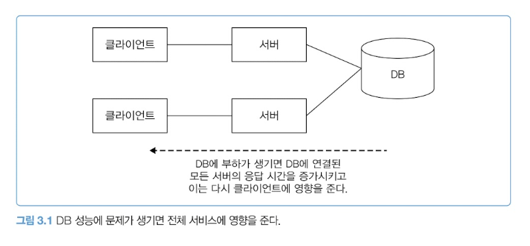

여러 서버가 하나의 DB를 공유하므로, DB 부하는 **전체 서비스**로 번진다.

**알아두기 — 풀 스캔**: 테이블 전체를 순차적으로 읽는 것. 조건에 맞는 인덱스가 없거나, 인덱스보다 전체 탐색이 빠를 때 발생.

> **이 장의 전제**: DB 자체가 문제인 경우는 많지 않다. 서버 개발자가 조금만 신경 써도 대부분의 DB 성능 문제는 줄일 수 있다.

---

## 3.2 조회 트래픽을 고려한 인덱스 설계 (p.54-62)

### 같은 쿼리, 다른 결론

```sql
select ... from article where category = 10 order by id desc limit 20, 10
```

`category`에 인덱스가 없으면 풀 스캔. 그런데 결론이 갈린다.

|             | 사내 공지 게시판  | 인기 커뮤니티        |
| ----------- | ----------------- | -------------------- |
| 누적 데이터 | 10년 = **520건**  | 6년 = **1,000만 건** |
| 트래픽      | 약 6.67 TPS       | 다수 동시 조회       |
| 풀 스캔 시  | 문제 없음         | CPU 100%, DB 마비    |
| 결론        | 인덱스 **불필요** | 인덱스 **필수**      |

> **풀 스캔이 나쁜 게 아니라, 데이터가 많을 때 나쁜 것이다.**

**알아두기 — 전문 검색**: `like '%어%'`는 풀 스캔 유발. 엘라스틱서치, 또는 MySQL FULLTEXT / Oracle Text.
🌱 [검색엔진 vs DB 전문검색](./검색엔진_vs_DB_전문검색.md)

### 단일 vs 복합 인덱스

activityLog: 하루 50만 건, 한 달 1,500만 건. `userId` 인덱스는 확정, **`activityDate`를 넣느냐가 고민.**

판단 기준은 **사용자 1명당 데이터가 몇 건 쌓이는가.**

| 사용자 유형  | 누적        | 선택                               |
| ------------ | ----------- | ---------------------------------- |
| 주 1회 × 5건 | 5년 1,500건 | 단일 `(userId)` 로 충분            |
| 매일 × 30건  | 1년 1만 건+ | 복합 `(userId, activityDate)` 필요 |

> 칼럼을 하나 더 붙일지는 **앞 칼럼이 좁힌 뒤에도 많이 남는가**로 판단.

### 선택도(selectivity)

고유값이 많을수록 선택도가 높고, 높을수록 인덱스 효율이 좋다. **다만 고유값 개수만으로 판단하면 틀린다.**

|                  | `member.gender`   | `jobqueue.status`      |
| ---------------- | ----------------- | ---------------------- |
| 고유값           | 3개 (M/F/N)       | 3개 (W/P/C)            |
| 데이터 분포      | 50만 / 50만 / 1천 | 대부분 C, W·P는 극소수 |
| 조건이 남기는 행 | 50만 건 (50%)     | 몇 건                  |
| 인덱스 효과      | **없음**          | **큼**                 |

> 판단 기준은 값의 종류 수가 아니라 **조건이 실제로 걸러내는 행의 비율**.
> 작업 큐는 선택도와 무관하게 `status` 인덱스가 필요하다.

### 커버링 인덱스

일반 인덱스는 ① 인덱스로 대상 선택 → ② **실제 데이터를 읽어 칼럼값 확보**. 조회 칼럼이 인덱스에 다 있으면 ②가 사라진다.

### 인덱스는 필요한 만큼만

효과 없는 인덱스의 비용: **쓰기 시 갱신 시간 + 메모리·디스크 사용량.**

**대안 — 요구사항을 조정한다** (reservation 테이블, 인덱스는 `reserveDate` 하나)

|         | 쿼리                                 | 결과             |
| ------- | ------------------------------------ | ---------------- |
| 변경 전 | `where name = ?`                     | 풀 스캔          |
| 변경 후 | `where reserveDate = ? and name = ?` | 기존 인덱스 사용 |

> 새 쿼리가 기존 인덱스를 못 쓸 때, **요구사항을 바꿀 수 있는지 먼저 검토.**

**Column** — 담당자가 바뀌며 인덱스 지식이 소실돼 같은 칼럼에 인덱스가 중복 생성되는 일이 있다. 2개라고 2배 빨라지지 않고, 관리 비용만 는다.

---

## 3.3 몇 가지 조회 성능 개선 방법 (p.63-76)

> 앞 4개는 **코드로**, 뒤 2개는 **돈으로** 해결한다. 실무 판단 순서도 같다.

### ① 미리 집계하기

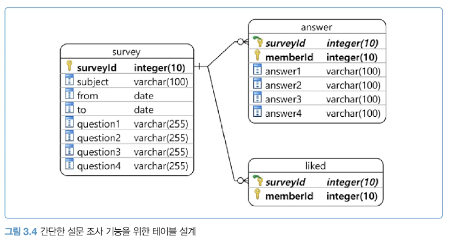

설문 목록에 답변 수·좋아요 수를 표시 → select 절에 서브 쿼리.

| 쿼리            | 횟수        | 소요       |
| --------------- | ----------- | ---------- |
| 목록 조회       | 1번         | 0.01초     |
| 답변 수 count   | 30번        | 0.1 × 30   |
| 좋아요 수 count | 30번        | 0.05 × 30  |
|                 | **총 61번** | **4.51초** |

목록 1건마다 쿼리가 2개씩 붙는 구조가 문제.

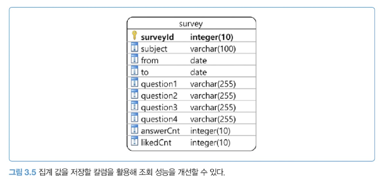

**해결**: `answerCnt`, `likedCnt` 칼럼 추가. 답변 등록 시 `update ... set answerCnt = answerCnt + 1`.

> **조회 시점의 비용을 쓰기 시점으로 옮긴 것.** 목록 조회가 답변 등록보다 훨씬 자주 일어나기 때문에 이득이다.

**Column — 비정규화해도 괜찮나요?**
명백한 중복이고 무결성이 깨질 수 있다. 그럼에도 저자는 추가가 맞다고 본다. ① 실제 10,150인데 10,149여도 목록 보는 회원에겐 무관 ② 정확한 값은 answer 테이블로 언제든 구할 수 있다.

**Column — 동시성 문제는 없나요?**
`set cnt = cnt + 1`을 5명이 동시 실행하면, 원자적으로 처리되지 않을 경우 결과를 예측할 수 없다. **DBMS와 격리 수준에서 원자적인지 검증 필요.**
🌱 [동시성 문제](./동시성_문제.md)

### ② 페이지 기준 대신 ID 기준 조회

```sql
order by id desc limit 10 offset 99990;
```

**DB는 어떤 id가 99,991번째인지 모른다.** 그래서 99,990개를 세고 나서 10개를 조회한다.

| 페이지 | offset | 실제로 읽는 양 |
| ------ | ------ | -------------- |
| 1      | 0      | 10건           |
| 100    | 990    | 1,000건        |
| 10000  | 99990  | **100,000건**  |

`where deleted = false`가 붙으면 더 나빠진다. 각 행의 실제 데이터를 읽어야 하고, true인 행도 섞여 있어 10,000개를 세려면 그 이상 읽는다. **인덱스에 넣어도 세는 시간은 남는다.**

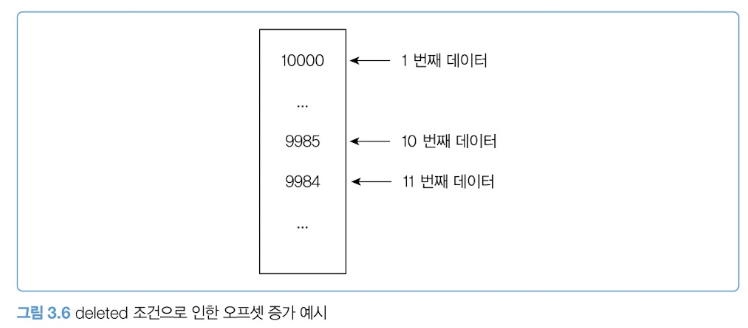

**해결**: 직전 조회의 마지막 id를 조건으로 쓴다.

```sql
where id < 9985 and deleted = false order by id desc limit 10;
```

id는 주요 키이므로 9984를 **바로 찾는다.** 세는 과정이 사라진다.

**다음 데이터 존재 여부**는 `limit 11`로 판단. 11개면 `hasNext: true`, 응답은 10개만.

|                  | offset          | ID 기준     |
| ---------------- | --------------- | ----------- |
| 전체 페이지 수   | count 쿼리 필요 | 불필요      |
| 임의 페이지 이동 | 가능            | **불가**    |
| 뒤로 갈수록      | 느려짐          | 일정        |
| 맞는 UI          | 페이지 번호     | 무한 스크롤 |

### ③ 조회 범위를 시간 기준으로 제한

- **일자 단위**: 포털 뉴스는 일자별로 분류 → `where regdt >= ? and regdt < ?`
- **월 단위**: 주문 내역을 30개씩이 아니라 월별로 → 인덱스 `(customerId, orderDt)`
- **최신만**: 점검 결과는 최근 6개월, 공지는 최근 몇 달

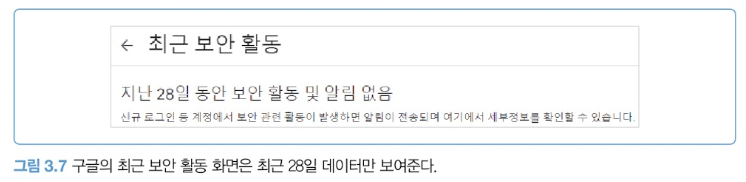

> 최신만 보여줘도 되는지 **제품 담당자와 협의하자.** 기능을 줄이면 구현이 단순해진다.

**보너스**: 최신 데이터가 더 자주 조회되므로 DB 메모리 캐시 적중률도 올라간다.

### ④ 전체 개수 세지 않기

목록에 전체 개수를 표시하려면 `count(*)` 쿼리가 추가로 필요하다. count는 **조건에 맞는 데이터를 전부 탐색**하므로 데이터가 늘면 함께 느려진다.

> 서비스 담당자에게 알리고, **전체 개수를 표시하지 않는 방향으로 협의.**

**Column — 평소 패턴을 숙지하고 이상 징후 찾기**

| 평소    | 응답 0.5초, 히트맵에 0.5초 띠                |
| ------- | -------------------------------------------- |
| 어느 날 | 띠가 살짝 위로 → 실제 0.7초                  |
| 원인    | 서브 쿼리 count가 데이터 증가로 0.2초 느려짐 |
| 조치    | 미리 집계로 변경 → **0.4초**                 |

0.7초는 당장 문제 될 속도가 아니다. 평소 그래프를 안 봤다면 놓쳤을 변화.

### ⑤ 오래된 데이터 삭제 및 분리 보관

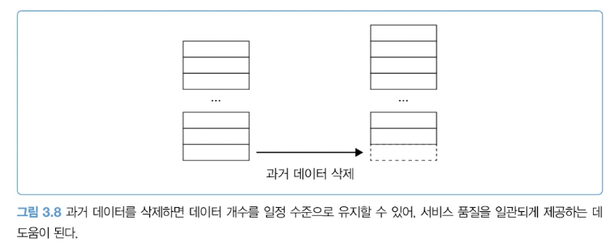

데이터가 늘지 않으면 실행 시간도 일정하게 유지된다. 로그인 시도 내역처럼 장기 보관이 불필요한 데이터는 매일 181일 이전 것을 삭제.

관리 시스템에 과거 데이터가 필요하면 → 서비스 DB엔 180일, **나머지는 별도 저장소로 분리.**

**알아두기 — 단편화**: DELETE해도 디스크 용량은 안 줄어든다(삭제 표시만 남기고 공간은 재사용). 추가·변경·삭제가 반복되면 **단편화**로 디스크 I/O가 늘고 성능이 저하된다. **최적화(optimize)** 작업으로 재배치.

### ⑥ DB 장비 확장하기

**수직 확장** — 개선 방법을 못 찾았거나 시간이 필요하면, 일단 장비를 키워 **서비스를 유지하고 개선할 시간을 번다.** 클라우드면 CPU·메모리를 짧은 시간에 올릴 수 있다.

**Column — 장비발**: 간헐적으로 5초 넘던 쿼리가 DB 장비 교체 후 0.5초 미만으로.

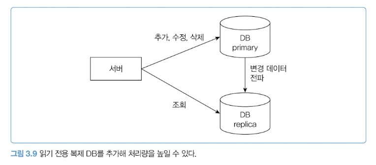

**수평 확장** — 변경은 Primary, 조회는 Replica. 조회 트래픽이 늘면 Replica를 추가.

**Memo**: DB 서버는 비싸고, 수평 확장은 **고정 비용을 영구적으로 올린다.** 비용 대비 이점이 확실해야 한다.

**Column — DBA가 없어요**: 복제 DB 구성은 서버 개발자에게 부담스럽다. 저자도 DBA가 처리했다. 소규모 회사는 DB 전문 회사와 컨설팅 계약도 방법.
🌱 [읽기 전용 DB](./읽기_전용_DB.md)

### ⑦ 별도 캐시 서버 구성하기

DB만으로 트래픽 처리가 어렵거나, 비용 문제로 장비를 더 못 키울 때. 대규모 서비스는 캐시 서버를 기본으로 쓴다.

**대규모가 아니어도** DB 확장보다 적은 비용으로 더 많은 트래픽을 처리할 수 있고, 구성 부담도 상대적으로 적다. 코드 수정 비용 대비 처리량 증가가 크다면 합리적인 선택.
🌱 [별도 캐시 서버 구성하기](./별도_캐시_서버_구성하기.md)

---
## 3.4 알아두면 좋을 몇 가지 주의 사항 (p.77-85)

> 앞 절이 "빠르게 만드는 법"이었다면, 이 절은 **"터지지 않게 하는 법"** 이다.

### 쿼리 타임아웃

응답 시간이 길어지면 처리량이 반비례해 감소한다. **그런데 거기서 끝나지 않는다.**

```
쿼리 15초로 지연 → 사용자가 몇 초 만에 재시도
→ 앞 요청은 아직 처리 중인데 새 요청 유입
→ 동시 처리 요청 수가 기하급수적으로 증가 → 서버 부하 폭증
```

**해결: 실행 시간 제한(타임아웃).**
5초로 제한하면 초과 시 에러가 발생한다. 사용자는 에러 화면을 보지만, **서버 입장에서는 요청이 정상 종료된 것**이다. 재시도가 들어와도 이전 요청이 살아 있지 않으므로 폭증을 막는다.

| 기능 | 타임아웃 |
|---|---|
| 블로그 글 조회 | 몇 초 이내로 짧게 |
| 상품 결제 | 길게 — 중간에 끊기면 후속 처리와 정합성이 복잡해짐 |

### 상태 변경 기능은 복제 DB에서 조회하지 않기

"변경은 Primary, 조회는 Replica"를 잘못 이해해 **모든 SELECT를 복제 DB로 보내는 경우**가 있다.

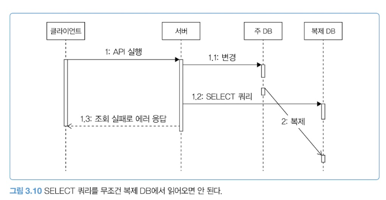

**문제 1 — 복제 지연.** 변경 데이터는 ① 네트워크로 전달 → ② 복제 DB가 반영, 두 단계를 거친다. 이 지연 동안 두 DB는 **서로 다른 값**을 갖는다. 변경 직후 복제 DB를 조회하면 잘못된 데이터를 읽는다.

**문제 2 — 트랜잭션.** 복제는 **커밋 시점**에 이뤄진다. Primary의 트랜잭션 안에서 데이터를 바꾸고, 그 대상을 복제 DB에서 조회하면 불일치가 발생한다.

> INSERT/UPDATE/DELETE를 수행하는 기능에서 **변경 대상 데이터를 조회해야 한다면, 반드시 주 DB에서 SELECT 한다.**

### 배치 쿼리 실행 시간 증가

배치는 `group by` + `count`/`sum` 으로 대량 집계를 수행한다. 데이터가 늘면 실행 시간도 는다.

**진짜 문제는 선형적으로 늘지 않는다는 것.** 집계 쿼리는 많은 메모리를 쓰는데, **특정 임계점을 넘으면 실행 시간이 예측 불가능하게 길어진다.** 30초짜리가 몇 분 → 몇십 분 → 어느 날 몇 시간이 지나도 안 끝난다.

> 예방책은 **배치 쿼리 실행 시간을 지속 추적**하는 것. 갑자기 증가하면 그때 원인을 찾는다.

가장 빠른 해결은 장비 사양 증설이지만 항상 가능하진 않다. 대안 2가지:

**① 커버링 인덱스** — 집계 대상 칼럼이 인덱스에 있으면 데이터를 직접 읽지 않고 인덱스만 스캔해 집계한다. 속도도 빨라지고 **메모리 사용량도 줄어든다.**

**② 데이터를 일정 크기로 나눠 처리**

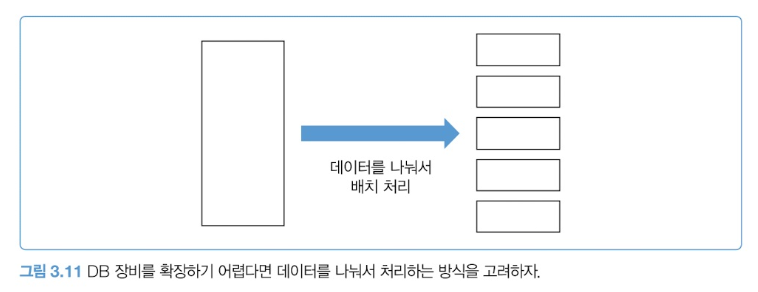

```sql
-- 한 달치를 한 번에 (임계점을 넘으면 안 끝남)
where accessDatetime >= '2024-08-01' and accessDatetime < '2024-09-01'

-- 하루 단위로 쪼개서 31번 실행 후 합침
where accessDatetime >= '2024-08-01' and accessDatetime < '2024-08-02'
```

하루도 길면 1시간, 10분 단위로. 이렇게 하면 **실행 시간을 일정 수준으로 유지**할 수 있다.

나아가 새벽 배치 대신 **10분 간격 상시 집계**로 바꿀 수도 있다.
```
① 통계 테이블에 반영된 마지막 accessDatetime을 구한다
② [마지막 시각, +10분] 구간의 accessLog를 집계한다
③ 결과를 통계 테이블에 반영한다
```

**Column — 오늘 매출 집계 데이터가 없어요!**

담당자가 해외 여행 중일 때 매출 집계가 멈춤. 특정 쿼리가 **3시간 넘게 실행 중**이었고 언제 끝날지 알 수 없는 상황. DB 장비 확장이 불가능해 프로그램을 수정해야 했다.

| 원인 | `insert ... select` 로 조회와 수정을 동시에 수행 → 쿼리 시간 + **테이블 잠금 시간**까지 길어짐 |
|---|---|
| 조치 ① | `insert ... select` 를 select와 insert로 **분리** |
| 조치 ② | select 결과를 한 트랜잭션이 아니라 **일정 개수씩 나눠 반영** |
| 결과 | 3시간+ → **약 30분** |

> 대량 변경 작업을 여러 개의 작은 작업으로 분할한 것이 핵심.

### 타입이 다른 칼럼 조인 주의

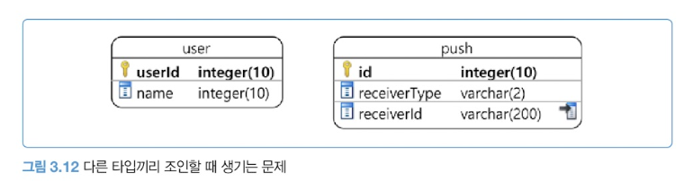

push 테이블은 수신 타입이 여러 개(회원/기기 등)이고 타입마다 식별자 형식이 달라, `receiverId`를 **varchar**로 정의했다. 조회가 잦아 인덱스도 걸었다.

```sql
where u.userId = 145 and u.userId = p.receiverId and p.receiverType = 'MEMBER'
```

인덱스를 쓸 것 같지만 **못 쓸 수 있다.** `user.userId`는 integer, `push.receiverId`는 varchar이기 때문.

> 비교 과정에서 DB가 **각 행마다 타입 변환**을 수행한다.
> 그 결과 `receiverId` 인덱스를 온전히 활용하지 못한다.
> 인덱스만 스캔하더라도 데이터가 많으면 변환 비용 때문에 느려진다.

**해결: 비교 전에 타입을 맞춘다** (MySQL 예)

```sql
and cast(u.userId as char character set utf8mb4) collate 'utf8mb4_unicode_ci' = p.receiverId
```

**Memo**: 문자열 비교 시 **캐릭터셋이 같은지도 확인**해야 한다. 다르면 그 자체로 변환이 발생한다.

### 테이블 변경은 신중하게

> 데이터가 많은 테이블에 칼럼을 추가하거나 타입을 변경할 때는 **매우** 주의해야 한다.
> 무심코 변경했다가 서비스가 장시간 중단될 수 있다.

**왜냐면 DB의 변경 방식 때문이다.** MySQL은 테이블을 변경할 때
```
새 테이블 생성 → 원본 데이터 전부 복사 → 완료되면 교체
```
**이 복사 과정에서 UPDATE/INSERT/DELETE가 허용되지 않는다.** 복사 시간만큼 서비스가 멈춘다.

DML을 허용하며 변경하는 방법(온라인 DDL)도 있지만 **항상 가능하진 않다.** 그래서 데이터가 많은 테이블은 점검 시간을 잡고 변경하는 경우가 많다.

DBA가 있으면 판단해주지만, **없으면 스스로 판단해야 하므로 더 신중해야 한다.**

**Column — 서비스를 멈추게 한 테이블 변경**

수천만 건 테이블의 열거 타입 칼럼 변경. 온라인 DDL을 쓰지 않아 복사 과정이 시작됐고, **십 분이 지나도 끝나지 않았다.** 여러 기능이 쓰는 테이블이라 서비스 제공 불가 → 점검 모드 전환.

몇 시간 뒤 변경 완료. **그런데 끝이 아니었다.** 주 DB만 끝났을 뿐 **복제 DB 변경은 여전히 진행 중**이었고 추가 시간이 더 필요했다. 후속 조치는 며칠간 이어졌다.

> **단 한 줄의 테이블 변경 쿼리가 8시간 가까이 서비스를 중단시켰다.**

### DB 최대 연결 개수

**상황**: API 서버 3대, 트래픽 증가로 수평 확장 필요, DB CPU는 20%로 여유 있음.

API 서버를 추가했는데 **DB 커넥션 생성에 실패한다면?** DB 자원에 여유가 있는데 연결이 안 된다면 **최대 연결 개수**를 확인해야 한다.

| 항목 | 값 |
|---|---|
| DB 최대 연결 수 | 100 |
| API 서버당 커넥션 풀 | 30 |
| 서버 4대로 확장 시 필요 | **120** |
| 결과 | 20개가 연결 실패 |

이 경우엔 **최대 연결 개수를 늘리는 것만으로 해결**된다.

> ⚠️ 단, **DB CPU가 70% 이상이면 연결 개수를 늘리면 안 된다.**
> 연결이 늘수록 DB 부하가 증가해 성능이 더 나빠진다.
> 이때는 캐시 서버 구성이나 쿼리 튜닝으로 **부하를 먼저 낮춘 뒤** 늘린다.

---

## 3.5 실패와 트랜잭션 고려하기 (p.86-88)

> 서버 초심자가 자주 놓치는 것 중 하나가 DB 트랜잭션이다.
> 모든 코드가 항상 정상 동작하지는 않으므로 **비정상 상황에서의 처리**를 반드시 고민해야 한다.

### 실수 1: 트랜잭션 없이 여러 데이터를 수정

데이터 변경 코드가 트랜잭션 안에서 실행되는 게 당연해 보이지만, **실제로는 그렇지 않은 코드를 여러 회사에서 자주 보게 된다.**

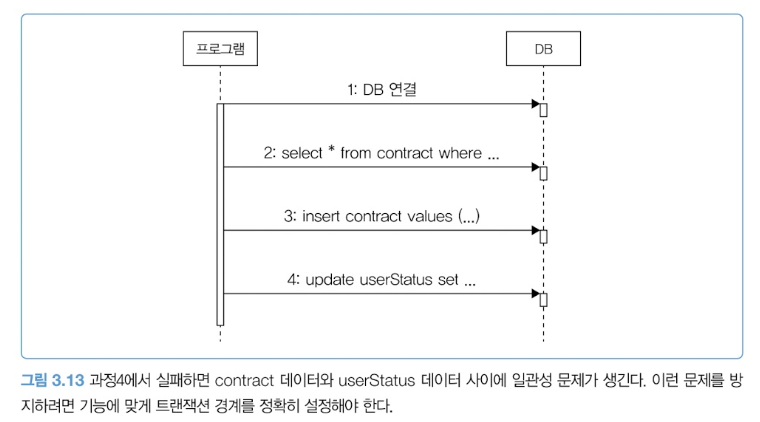

```
1. DB 연결
2. select * from contract where ...   ← 계약 존재 확인
3. insert contract values (...)
4. update userStatus set ...
```

**과정 4가 실패하면?**

| contract 테이블 | 데이터가 이미 추가됨 |
|---|---|
| userStatus 테이블 | 상태 반영 안 됨 |
| 사용자 입장 | 계약 상태가 그대로니 **다시 계약 시도** |
| 결과 | contract에 이미 데이터가 있어 **더 이상 진행 불가** |

> DB 관련 코드를 작성할 때는 **트랜잭션의 시작과 종료 경계를 명확히 설정했는지** 반드시 확인한다.

### 실수 2: 롤백하면 안 되는 것까지 롤백

보통은 오류가 나면 전체를 롤백한다. **하지만 일부 오류는 무시하고 커밋해야 하는 경우도 있다.**

```java
@Transactional
public void join(JoinRequest join) {
    memberDao.insert(member);       // DB에 회원 추가
    mailClient.sendMail(...);       // 메일 발송 (실패 시 RuntimeException)
}
```

메일 서버에 일시적 문제가 생기면 `@Transactional`이 **런타임 예외에 전체를 롤백**한다.
→ **회원 데이터가 정상 추가됐는데도 가입 전체가 실패한다.**

> 환영 메일을 못 보냈다는 이유로 회원 가입 자체가 실패하는 것을 원하지는 않을 것이다.

**해결: 무시할 오류는 명시적으로 처리한다.**

```java
@Transactional
public void join(JoinRequest join) {
    memberDao.insert(member);
    try {
        mailClient.sendMail(...);
    } catch (Exception ex) {
        // 메일 발송 오류 무시
        // 로그로 기록해 모니터링
    }
}
```

> 외부 API 연동과 DB 작업이 섞이면 트랜잭션 처리가 복잡해진다.
> **외부 API는 성공했는데 DB 작업이 실패하는 상황**이 대표적이다. (→ 4장)

🌱 [트랜잭션 경계 설계](./트랜잭션_경계_설계.md)
