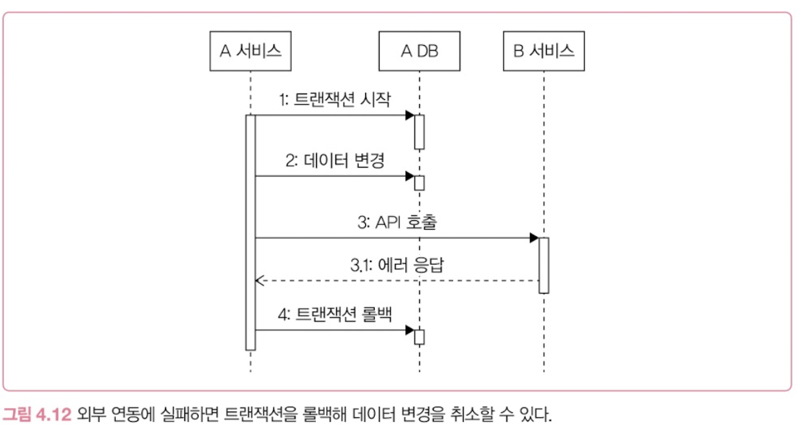
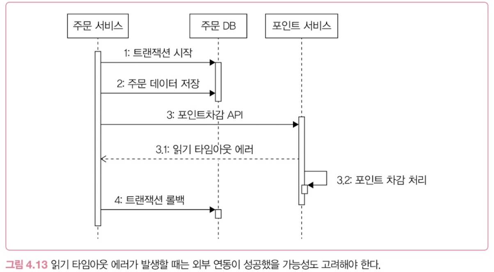
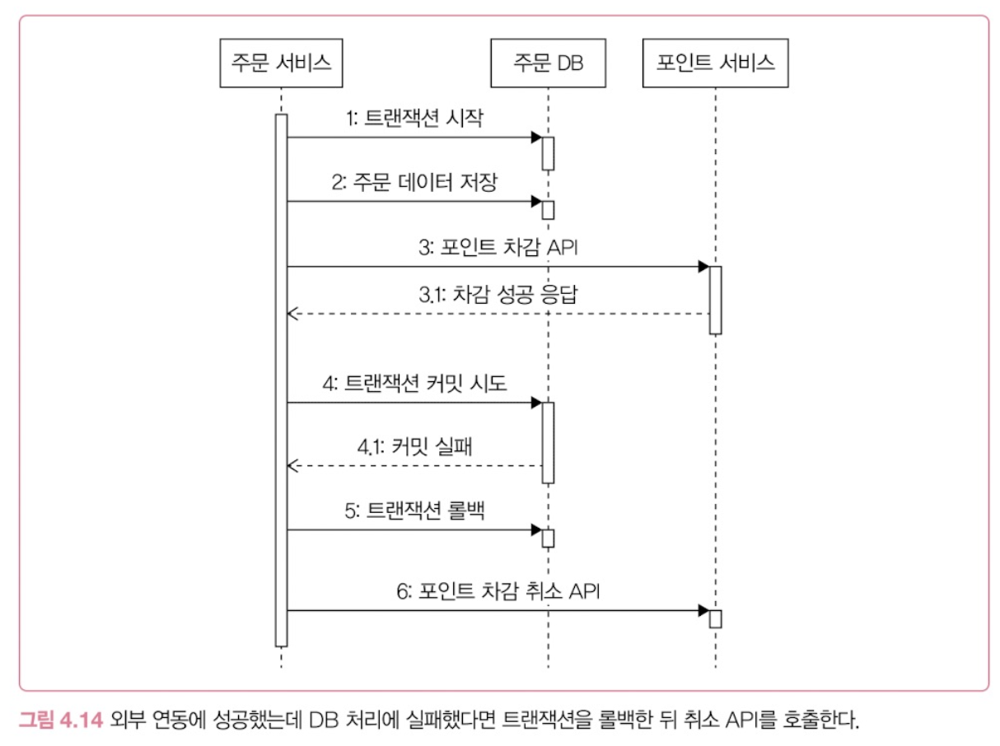

## 외부 연동이란

서비스 간 내부·외부 연동은 계속 증가하고 있다.

**⇒ 외부 연동에 주의를 기울이지 않으면 서비스는 심각한 장애를 겪을 수 있다.** 

- ***사례: 외부 연동 품질에 신경 쓰지 않아 장애가 발생한 은행***
    - 개발팀은 대규모 트래픽 처리에 자신이 있었지만, 서비스 오픈 후 회원 가입이 정상적으로 처리되지 않았다.
    - 원인은 가입 과정에서 호출한 **외부 정보 인증 서비스**였다.
    - 외부 서비스가 몰려드는 트래픽을 감당하지 못하면서 은행 서비스까지 장애를 겪었다.
    

## 외부 연동에서 발생하는 문제 그리고 해결법들

- [**타임아웃**](#타임아웃)
- [**재시도**](#재시도)
- [**동시 요청 제한**](#동시-요청-제한)
- [**서킷 브레이커**](#서킷-브레이커)
- [**외부 연동과 DB 연동**](#외부-연동과-db-연동)
- [**HTTP 커넥션 풀**](#http-커넥션-풀)
- [**연동 서비스 이중화**](#연동-서비스-이중화)

 
 

### 타임아웃

---

> 타임아웃은 응답 시간과 관련이 있고, 응답 시간은 서비스 처리량에 영향을 준다.
따라서 전체 서비스의 품질을 보호하려면 **연동 서비스 호출에 적절한 타임아웃을 설정해야 한다.**

#### 타임아웃의 필요성

- 연동 서비스의 응답이 느릴 때 **타임아웃을 설정하지 않으면**, **요청 처리 자원이 계속 점유되어 서비스 처리량이 급격히 떨어진다.**
    - ***사례: 외부 연동 서비스 호출 시 타임아웃을 적절히 설정하지 않을때***
        - A 서비스의 톰캣 스레드 풀 크기는 200이며, A 서비스는 B 서비스를 호출한다.
        - B 서비스의 성능 문제로 응답 시간이 60초를 넘기기 시작한다.
        - 사용자 100명이 동시에 요청하면, 100개의 스레드가 B 서비스의 응답을 기다리며 점유된다.
        - 10초 후 새로운 요청 100개가 들어오면 나머지 100개의 스레드도 점유된다.
        - 결국 모든 스레드가 사용되어 이후 요청을 처리하지 못하고, A 서비스까지 마비된다.
- 응답이 없으면 사용자는 새로고침 등을 통해 요청을 반복한다. 이로 인해 서버 부하가 더욱 증가하므로 **외부 연동에는 반드시 타임아웃을 지정해야 한다.**

 

#### 타임아웃의 효과

- 타임아웃을 설정하면 **사용자는 일정 시간 후 에러 화면을 보게 된다**. 에러가 발생하더라도 **응답 없이 무한정 기다리는 것보다는 낫다.**
    - ***사례: 외부 연동 서비스 호출 시 타임아웃을 5초로 설정했을 때***
        - B 서비스의 응답에 60초가 걸리더라도 A 서비스는 5초 후 타임아웃 에러를 반환한다.
        - 이후 들어오는 요청도 5초 뒤 에러로 처리되므로 스레드가 장시간 점유되지 않는다.
- 스레드 풀 등의 자원이 포화되기 전에 응답함으로써 **외부 서비스의 문제가 다른 기능으로 확산되는 것을 줄일 수 있다.**

 

#### 타임아웃의 종류: 연결 타임아웃과 읽기 타임아웃

> **API 연동 과정에서의 통신 과정**
> 
> 1. **`A서비스 → B서비스`** 로의 **연결 시도**
>     1. **`B서비스 → A 서비스`** 로의 **연결 성공**
> 2. **`A서비스 → B 서비스`** 로의 **요청 전송**
>     1. **`B서비스 → A 서비스`** 로의 **응답 전송**
> 3. **`A서비스 → B 서비스`** 로의 **연결 종료**
>

##### 연결 타임아웃(Connection Timeout)

- 외부 서비스와 **연결되기까지의 대기 시간을 제한한다**
- **초기 설정 시간: `3~5초`**, 이후 추이를 보며 조정한다

##### 읽기 타임아웃(Read Timeout)

- 요청을 전송한 후 **응답 데이터를 기다리는 시간**을 제한한다
- **초기 설정 시간: `5~30초`**, 이후 추이를 보며 조정한다
- **라이브러리마다 다른 타임아웃 기준과 실제 설정값의 의미**
    - **Apache HttpClient의 소켓 타임아웃**
        - 네트워크 패킷 수신 대기 시간을 기준으로 한다.
        - 전체 응답 시간에 대한 타임아웃이 아니므로, 5초로 설정해도 전체 응답에는 5초 이상 걸릴 수 있다.
    - **OkHttp의 호출 타임아웃**
        - 요청 시작부터 응답 완료까지의 전체 시간을 기준으로 한다.
        
        ⇒ **`소켓 타임아웃을 5초, 호출 타임아웃을 10초`**로 설정하면 패킷이 계속 들어오더라도 전체 호출 시간이 10초를 넘을 때 타임아웃을 발생시킬 수 있다.

 

> **연결 타임아웃보다 읽기 타임아웃을 길게 설정하는 이유**
> 
> - 읽기 타임아웃을 처음부터 1~3초로 짧게 설정하면 타임아웃 에러가 자주 발생할 수 있다.
> - 연동 서비스가 정상적으로 처리했더라도 응답이 조금 늦다는 이유로 실패할 수 있다.
> - 따라서 초기에는 일반적으로 **연결 타임아웃보다 읽기 타임아웃을 길게 설정하고, 운영 지표를 확인하며 조정한다.**

 
 

### 재시도

---

> 네트워크 통신 과정에서 **간헐적으로 연결에 실패하거나 응답이 느려지는 경우**가 있다. 이럴때 **재시도로 연동 실패를 성공으로 바꾼다.**
> 

#### 재시도 가능 조건

> **연동 API를 다시 호출해도 되는 조건인지 확인**해야 재시도를 할 수 있다.

1. **단순 조회 기능**
    - 포인트 내역 조회처럼 다시 호출해도 데이터 문제가 발생하지 않는 기능은 재시도할 수 있다.
    - 일시적인 문제로 실패했다면 재시도를 통해 정상 처리될 가능성이 높다.
2. **연결 타임아웃**
    - 연결 타임아웃은 아직 연동 서비스에 연결되지 않아 요청이 처리되지 않은 상태를 의미하기에, 재시도를 통해 연결에 성공할 수 있다.
3. **멱등성을 가진 변경 기능**
    - **멱등성**이란 같은 연산을 여러 번 실행해도 결과가 달라지지 않는 성질이다.
    - **상태를 변경하는 API는 멱등성이 보장되는 경우에 재시도할 수 있다.**
    - ***사례: 좋아요 API***
        - 아직 좋아요를 누르지 않았다면 좋아요 정보를 추가하고, 좋아요 수를 증가시킨 후 `200` 상태 코드를 응답한다.
        - 이미 좋아요를 눌렀다면 아무 작업도 하지 않고 `200` 상태 코드를 응답한다.
        - 같은 사용자가 여러 번 호출해도 좋아요는 한 번만 반영되므로, 읽기 타임아웃 후 재시도해도 데이터 문제가 발생하지 않는다.

 

#### 재시도시 주의사항

- **읽기 타임아웃**
    - 읽기 타임아웃이 발생했다면 연동 서비스가 이미 요청을 처리하고 있을 수 있다.
    - 이때 멱등성이 보장되지 않은 요청을 재시도하면 포인트 중복 차감과 같은 데이터 문제가 발생할 수 있다.
- **재시도해도 해결되지 않는 오류**
    - 같은 API라도 **실패 원인에 따라 재시도 여부를 결정해야 한다.**
    - 잘못된 입력으로 발생한 검증 오류는 재시도해도 동일하게 실패할 가능성이 높다.
    - 예를 들어 좋아요 API에 콘텐츠 ID를 빈 값으로 전달해 `400` 응답을 받았다면, 같은 요청을 다시 보내도 실패한다.

 

#### 재시도하기: 재시도 횟수와 간격 설정

##### 재시도 횟수

- 재시도 횟수를 무한정 둘 수 없다. (응답 시간도 함께 증가하기 때문)
- **일반적인 재시도 횟수: `1~2번`**
    - 2번 재시도를 했다는 것 = 총 3번 시도한 것
    - 이 모두 실패했을 경우, 간헐적인 오류가 아닌 다른 근본적인 문제일 가능성이 높다고 판단한다.

##### 재시도 간격

- 실패 직후 재시도하면 같은 원인으로 다시 실패할 가능성이 높다. 따라서 **일정한 간격을 두고 재시도한다.**
- 여러 번 재시도할 때는 **재시도 간격을 점진적으로 늘릴 수 있다.**
    - 첫번째 재시도 1초 뒤 → 두번째 재시도 2초 뒤
    - 이를 통해 연동 서버에 가해지는 부하를 줄일 수 있다.

 

#### 재시도 폭풍 안티패턴 : retry storm

> 재시도는 성공 가능성을 높이지만, **연동 서비스의 부하를 증가시킬 수 있다.**
> 
> 
> **⇒ 재시도를 적용할 때는 연동 서비스의 성능과 부하 상황도 함께 고려해야 한다.**
> 

 
 

### 동시 요청 제한

---

> 연동 서비스의 최대 처리량을 초과해 요청을 보내면 응답 시간이 느려지고, 이를 호출하는 서비스의 성능도 함께 저하된다.
> 
> 
> **⇒ 연동 서비스로 보내는 동시 요청 수를 제한해** 전체 서비스로 장애가 확산되는 것을 방지해야 한다.
> 

#### 동시 요청 제한 적용

- B 서비스의 동시 처리 한계가 100개라면, A 서비스도 B 서비스로 보내는 동시 요청을 100개로 제한한다.
    - 허용된 100개의 요청만 B 서비스로 보내고, **나머지 200개는 즉시 에러로 응답**한다.
- 이때 **`503 Service Unavailable`** 상태 코드를 사용하면 과부하 상황임을 클라이언트에 알릴 수 있다.

 

#### 벌크헤드 패턴(Bulkhead Pattern)

- 각 구성 요소를 격리하여 **한 구성 요소의 장애가 다른 구성 요소에 영향을 주지 않도록 하는 설계 패턴**이다.
- 동시 요청 제한도 벌크헤드 패턴에 해당한다.

 
 

### 서킷 브레이커

---

> 연동 서비스에 장애가 발생한 상태에서 요청을 계속 보내면 에러만 반복되고, 타임아웃을 기다리느라 응답 시간도 길어진다.
> 
> 
> **→  장애가 감지되면 연동 요청을 차단하고 바로 에러를 응답한 뒤, 서비스가 정상화되면 연동을 재개한다.**
> 
> ⇒ 응답 시간 증가와 처리량 감소 등 **외부 서비스 장애가 내부 서비스에 주는 영향을 줄일 수 있다.** 
> 

#### 서킷 브레이커의 3가지 상태

##### 1. 닫힘(Closed)

- 닫힘 상태일때, 모든 요청을 연동 서비스에 전달한다.
- 연동 실패가 지정한 임계치를 초과하면 **열림 상태**로 전환된다.
- **임계치 설정 예시**
    - **`시간 기준 오류 발생 비율`**: 10초 동안 오류율이 50%를 초과한 경우
    - **`개수 기준 오류 발생 비율`**: 100개 요청 중 오류율이 50%를 초과한 경우

##### 2. 열림(Open)

- 열림 상태일 때, 연동 서비스로 요청을 보내지 않고 **즉시 에러를 응답한다.**
- 지정된 시간 동안 상태를 유지하고, 시간이 지나면 **반열림 상태**로 전환된다.
- 요청이 전달되지 않는 동안 연동 서비스는 과부하에서 회복할 기회를 얻는다.

##### 3. 반열림(Half-Open)

- **일부 요청만 연동 서비스로 보내 정상화 여부를 확인**한다.
    - 요청이 성공하면 **닫힘 상태**로 돌아가 연동을 재개한다.
    - 요청이 실패하면 다시 **열림 상태**로 전환해 연동을 차단한다.

> **상태 전환 과정 정리**
> 
> 
> **`닫힘`** → 실패율이 임계치 초과 → **`열림`** → 차단 시간 경과 → **`반열림`**
> 
> - 반열림 상태에서 성공 → `닫힘`
> - 반열림 상태에서 실패 → `열림`

 

#### 빠른 실패(Fail Fast)

- 서킷 브레이커처럼 문제 상황을 빠르게 감지하고 문제가 있는 기능을 실행하지 않고 중단시키는 방식을 **빠른 실패**라고 한다.
- 사용자가 타임아웃까지 기다리지 않고 빠르게 에러를 확인할 수 있다.
- 장애가 발생한 기능에 부하가 더해지는 것을 막고, 불필요한 자원 낭비를 줄여 **전체 서비스의 안정성을 높인다.**

 
 

### 외부 연동과 DB 연동

---

> DB 처리와 외부 연동을 함께 수행하면 한쪽만 성공하고 다른 쪽은 실패할 수 있다.
> 
> 
> **⇒ 오류가 발생했을 때 트랜잭션과 두 시스템의 데이터 일관성을 어떻게 처리할지 고려해야 한다.**
> 

#### 외부 연동과 트랜잭션 처리

##### 1. `외부 연동`에 실패한 경우

- 트랜잭션 안에서 외부 연동에 실패하면 **트랜잭션을 롤백해 DB 변경을 취소할 수 있다.**
    
    
    
- 단, **읽기 타임아웃은 외부 서비스가 실제로 요청을 처리했을 가능성이 있으므로 주의해야 한다.**
    
    

    

>**트랜잭션을 롤백했는데 외부 서비스가 실제로 성공했을 경우, 후처리 3가지** 
>1. **주기적인 데이터 비교 및 보정 👍**
>    - 두 시스템의 데이터를 일정 주기로 비교한다.
>    - 불일치가 발견되면 수동 또는 자동으로 보정한다.
>2. **성공 여부 확인 API 호출 👀**
>    - 읽기 타임아웃 발생 후 이전 요청의 성공 여부를 확인한다.
>    - 성공했다면 트랜잭션을 계속하고, 실패했다면 롤백한다.
>3. **취소 API 호출 👀**
>    - 읽기 타임아웃 발생 후 이전 요청을 취소한다.
>        - 연동서비스는 취소 대상이 있다면 취소하고, 없다면 아무 작업 없이 성공 응답만 반환한다.
>    - 연동 처리를 취소했으므로 트랜잭션을 롤백한다.
>    
>    ⇒ 👀 여기서, 성공확인 API나 취소 API를 호출하는 방식은 당연하게도 **연동서비스가 지원할 때만 사용할 수 있음** 
>    
>    두 시스템간 데이터 일관성이 중요한 기능은, **정기적으로 데이터 일치를 확인하는 프로세스를 갖추는 것이 바람직함 👍**

 

##### 2. 외부 연동은 성공했지만 `DB 처리`에 실패한 경우

- DB 트랜잭션을 롤백한 뒤 **취소 API를 호출해 외부 서비스의 처리를 이전 상태로 되돌려야 한다.**
    - DB 처리 자체가 실패한 상황이므로 성공 여부 확인 API를 호출하는 것은 의미가 없다.
    
    
    
- 취소 API가 없거나 취소 요청도 실패할 수 있으므로, 데이터 일관성이 중요하다면 **주기적인 데이터 비교 및 보정 과정**을 갖춰야 한다.

> **즉, 어떠한 케이스라도 데이터 일관성이 중요한 기능은**
>
> **정기적으로 두 시스템의 데이터를 비교하고 보정하는 과정이 필요하다.**
> 

 

#### 외부 연동 지연으로 인한 DB 커넥션 풀 부족

- DB 트랜잭션 안에서 외부 연동을 수행하면, 외부 서비스의 응답을 기다리는 동안에도 **DB 커넥션이 계속 점유된다.**
    - 예시
        - DB 쿼리: `0.1초 + 0.1초`
        - 외부 연동 API 호출/실행: `4.8초`
        - 실제 **DB 처리 시간은 `0.2초`**지만, **커넥션은 총 5초 동안 점유**된다.
- 외부 연동 시간이 길어지면 DB 처리 시간에는 변화가 없어도 커넥션 풀이 포화될 수 있다.
    - 커넥션 풀 크기가 5인 상황에서 외부 연동 시간이 6.8초로 증가하면, 새로운 요청은 커넥션을 얻기 위해 대기하게 된다.
    

**해결 방법**

- DB 연동과 외부 연동이 서로 독립적이라면, 외부 연동을 **DB 커넥션을 사용하기 전이나 트랜잭션이 끝난 후에 실행하는 방법**을 고려할 수 있다.
    - 외부 연동이 느려져도 DB 커넥션이 불필요하게 점유되는 것을 막을 수 있다.
- 단, **트랜잭션 커밋 후 외부 연동에 실패하면** DB 롤백이 불가능하므로 후처리가 필요하다.
    - **후처리 방법1**: DB에 반영된 데이터를 되돌리는 **보상 트랜잭션**
    - **후처리 방법2**: 불일치 데이터를 나중에 수정하는 **데이터 후속 보정**

 
 

### HTTP 커넥션 풀

---

> HTTP 연결 과정은 전체 요청 시간에서 큰 비중을 차지할 수 있다.
> 
> 
> **⇒ HTTP 커넥션 풀을 사용해 기존 연결을 재사용하면 연결 시간을 줄이고 응답 속도를 높일 수 있다.**
> 

#### HTTP 커넥션 풀 설정 시 고려사항 3가지

##### 1. 커넥션 풀 크기

- **연동 서비스의 처리 능력을 고려해 크기를 설정**해야 한다.
- 풀 크기를 무조건 늘리면 순간적으로 많은 요청이 전달되어 연동 서비스의 응답 시간이 느려질 수 있다.
- 연동 서비스의 성능 저하는 이를 호출하는 서비스 전체의 응답 시간에도 영향을 줄 수 있다.

##### 2. 커넥션 획득 대기 시간

- 사용할 수 있는 커넥션이 없다면, 요청은 기존 커넥션이 반환될 때까지 대기한다.
    - 예: 풀 크기가 10일 때 요청 11개가 들어오면, 10개는 실행되고 나머지 1개는 대기한다.
- **대기 시간이 길어지면 전체 응답 시간도 증가하므로 수초 이내로 짧게 설정**한다.
- **추천 설정 시간: `1~5초`**
    - 너무 짧으면 일시적인 트래픽 증가에도 커넥션을 얻지 못해 에러가 발생할 수 있다.
    - 너무 길면 연동 서비스가 느려졌을 때 전체 응답 시간도 함께 늘어난다.

##### 3. 커넥션 유지 시간(Keep-Alive)

- HTTP 커넥션은 **무한정 유지되지 않으므로** **연동 서비스의 설정에 맞춰** 유지 시간을 지정해야 한다.
- 서버가 이미 종료한 커넥션을 다시 사용하면 에러가 발생할 수 있다.
- HTTP/1.1에서는 서버가 `Keep-Alive` 헤더로 연결 유지 시간을 지정할 수 있다.
- 클라이언트의 커넥션 풀은 서버가 지정한 시간보다 연결을 오래 유지하지 않도록 설정해야 한다.

 
 

### 연동 서비스 이중화

---

> 결제와 같은 핵심 연동 서비스에 장애가 발생하면 서비스의 핵심 기능을 제공하지 못하고 직접적인 손실로 이어질 수 있다.
> 
> 
> **⇒ 핵심 연동 서비스를 이중화하면 한 곳에 장애가 발생해도 다른 서비스를 이용해 기능을 계속 제공할 수 있다.**
> 

#### 연동 서비스 이중화 조건 3가지

1. **해당 기능이 서비스의 핵심 기능인가?**
    - 쇼핑 서비스의 결제처럼 장애가 발생했을 때 핵심 기능을 제공할 수 없다면 이중화를 고려할 수 있다.
    - 서비스에 미치는 영향이 작은 기능은 이중화의 우선순위가 낮을 수 있다.
2. **이중화 비용을 감당할 수 있는가?**
    - 연동 대상이 늘어나면 개발과 유지보수 비용도 함께 증가한다.
    - 외부 서비스 장애로 발생하는 손실과 이중화에 필요한 비용을 비교해 결정해야 한다.
    
- ***사례: 문자 발송 서비스 장애***
    - 회원 가입 과정에서 인증 문자를 보내는 외부 서비스에 장애가 발생해 사용자가 가입을 완료하지 못했다.
    - 문자 발송 서비스가 정상화될 때까지 고객과 영업팀 모두 불편을 겪었다.
    - 문자 발송 서비스를 이중화했다면 다른 서비스를 통해 인증 문자를 보내 장애의 영향을 줄일 수 있었다.
