# 5장 비동기 연동, 언제 어떻게 써야 할까

## 목차
- 비동기 연동
• 별도 스레드를 이용한 비동기 연동
• 메시징을 이용한 비동기 연동
• 트랜잭션 아웃박스 패턴
• 배치 전송
• CDO

## 5.1 동기 연동과 비동기 연동

### 동기 방식

기능을 개발할 때는 보통 코드가 실행되는 순서를 먼저 떠올린다. 예를 들어 로그인에 성공하면 포인트를 지급하는 기능은 다음과 같이 구현할 수 있다.

```java
public boolean login(String id, String password) {
    Optional<User> optionalUser = findUser(id);

    if (optionalUser.isEmpty()) {
        return false;
    }

    User user = optionalUser.get();

    if (!user.matchesPassword(password)) {
        return false;
    }

    PointResult result = pointClient.giveLoginPoint(id);

    if (result.isFailed()) {
        throw new PointException();
    }

    appendLoginHistory(id);
    return true;
}
```

이 코드는 다음 순서로 실행된다.

1. 사용자 정보를 조회한다.
2. 사용자가 없으면 `false`를 반환한다.
3. 암호가 일치하지 않으면 `false`를 반환한다.
4. 포인트 지급 서비스를 호출한다.
5. 포인트 지급에 실패하면 예외를 발생시킨다.
6. 로그인 내역을 기록한다.
7. `true`를 반환한다.

동기 방식은 한 작업이 끝난 후 다음 작업을 실행한다. 따라서 **코드의 작성 순서가 실행 순서와 일치한다.**

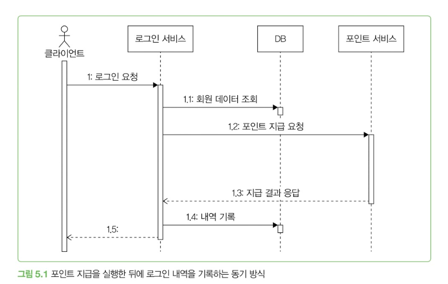

동기 방식은 실행 흐름을 이해하기 쉽고 디버깅하기도 편하다. 하지만 외부 서비스와 연동할 때는 다음 두 가지를 고려해야 한다.

- 외부 연동 실패가 전체 기능의 실패로 이어져도 되는가?
- 외부 서비스의 응답이 느려졌을 때 기다려도 되는가?

### 동기 연동의 문제

위 코드에서는 포인트 지급에 실패하면 로그인도 실패한다. 포인트 서비스에 장애가 발생하면 사용자는 로그인조차 할 수 없게 된다.

하지만 로그인과 포인트 지급의 중요도는 다르다. 포인트를 조금 늦게 지급하더라도 사용자는 정상적으로 로그인할 수 있어야 한다.

포인트 지급 실패가 로그인 실패로 이어지지 않도록 실패 내역을 기록할 수 있다.

```java
PointResult result = pointClient.giveLoginPoint(id);

if (result.isFailed()) {
    recordPointFailure(id, result);
}
```

그러나 이 방식도 포인트 서비스의 응답을 기다린다는 문제는 남아 있다. 외부 서비스가 느려지면 로그인 응답도 함께 느려진다.

> 다음 작업에 외부 연동 결과가 반드시 필요하지 않다면 비동기 연동을 검토할 수 있다.

---

### 비동기 방식

비동기 방식은 한 작업이 끝날 때까지 기다리지 않고 다음 작업을 실행한다.

포인트 지급을 비동기로 처리하면 로그인 서비스는 포인트 지급 결과를 기다리지 않고 사용자에게 로그인 성공을 응답할 수 있다.

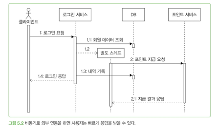

사용자가 로그인 응답을 받은 시점에도 포인트는 지급 중일 수 있다. 하지만 포인트가 수초 또는 수분 뒤에 지급돼도 문제가 없다면, 로그인 응답을 늦추는 것보다 비동기로 처리하는 편이 낫다.

비동기 연동을 사용하면 다음과 같은 장점이 있다.

- 사용자에게 더 빠르게 응답할 수 있다.
- 외부 서비스의 지연이 전체 서비스로 전파되는 것을 줄일 수 있다.
- 외부 서비스 장애와 핵심 기능을 분리할 수 있다.

---

## 비동기 연동을 적용할 수 있는 경우

다음 조건 중 일부를 만족한다면 비동기 연동을 검토할 수 있다.

### 1. 처리에 약간의 시차가 생겨도 되는 경우

- 주문 완료 후 판매자에게 푸시 알림 전송
- 학습 완료 후 포인트 지급
- 콘텐츠 등록 후 검색 서비스에 반영

주문 알림이 1분 늦거나 검색 결과가 10초 뒤에 나타나더라도 핵심 기능에는 큰 문제가 없다.

### 2. 실패했을 때 재시도할 수 있는 경우

- 푸시 전송 실패 후 재시도
- 포인트 지급 실패 후 재시도
- 인증번호가 오지 않았을 때 다시 받기

일시적인 장애가 발생하더라도 나중에 다시 처리할 수 있다면 즉시 결과를 기다릴 필요가 없다.

### 3. 나중에 수동으로 처리할 수 있는 경우

콘텐츠가 검색 서비스에 등록되지 않았다면 관리 도구를 이용해 다시 등록할 수 있다.

### 4. 실패를 무시해도 되는 경우

판매자에게 주문 알림이 전송되지 않아도 주문 자체는 정상적으로 처리된다. 알림 확인이 조금 늦어질 뿐 핵심 기능에는 영향을 주지 않는다.

---

## 비동기 연동 사례

비동기 연동은 다음과 같은 기능에 활용할 수 있다.

- 미션 달성 후 포인트 지급
- 주문 시스템의 정보를 회원 관리 시스템에 동기화
- 상품 주문 후 택배사에 집하 요청
- 주문 완료 후 판매자에게 알림 전송
- 콘텐츠 등록 후 검색 인덱스 갱신

---

## 비동기 연동 구현 방법

이 장에서는 다음 다섯 가지 방법을 다룬다.

1. 별도 스레드로 실행하기
2. 메시징 시스템 이용하기
3. 트랜잭션 아웃박스 패턴 사용하기
4. 배치로 연동하기
5. CDC(Change Data Capture) 이용하기

## 핵심 정리

> 외부 연동 결과가 현재 작업을 완료하는 데 반드시 필요하지 않고, 지연·재시도·수동 복구를 허용할 수 있다면 비동기 연동을 고려한다.

비동기 연동의 목적은 단순히 작업을 빠르게 실행하는 것이 아니다. **핵심 기능과 부가 기능을 분리해 외부 서비스의 지연과 장애가 전체 서비스로 전파되는 것을 막는 것**이 핵심이다.

---

## 5.2 별도 스레드로 실행하기

비동기 연동을 구현하는 가장 간단한 방법은 작업을 별도 스레드에서 실행하는 것이다. 주문 처리와 푸시 발송을 분리하면 푸시 발송이 끝나기 전에 주문 결과를 반환할 수 있다.

### 새로운 스레드 생성

```java
public OrderResult placeOrder(OrderRequest request) {
    // 주문 생성 처리

    new Thread(() -> pushClient.sendPush(pushData)).start();

    // 푸시 발송을 기다리지 않고 반환
    return successResult();
}
```

구현은 간단하지만 요청마다 새로운 스레드를 만들면 스레드 생성 비용과 메모리 사용량이 크게 증가할 수 있다.

---

### 스레드 풀 사용

매번 스레드를 생성하는 대신 일정한 개수의 스레드를 미리 만들어 재사용할 수 있다.

```java
private final ExecutorService executor =
        Executors.newFixedThreadPool(50);

public OrderResult placeOrder(OrderRequest request) {
    // 주문 생성 처리

    executor.submit(() -> pushClient.sendPush(pushData));

    // 푸시 발송을 기다리지 않고 반환
    return successResult();
}
```

스레드 풀을 사용하면 다음과 같은 장점이 있다.

- 스레드 생성 비용을 줄일 수 있다.
- 동시에 실행되는 스레드 수를 제한할 수 있다.
- 메모리 사용량을 일정하게 유지할 수 있다.

다만 스레드 수보다 많은 작업이 들어오면 남은 작업은 큐에서 대기해야 한다. 작업이 계속 쌓이면 큐가 가득 차거나 처리 지연이 발생할 수 있으므로 풀과 큐의 크기를 적절하게 설정해야 한다.

---

### Spring의 `@Async` 사용

Spring에서는 `@Async`를 이용해 특정 메서드를 별도 스레드에서 실행할 수 있다.

```java
@Service
public class PushService {

    @Async
    public void sendPushAsync(PushData pushData) {
        pushClient.sendPush(pushData);
    }
}
```

호출하는 쪽에서는 푸시 발송이 끝날 때까지 기다리지 않는다.

```java
public OrderResult placeOrder(OrderRequest request) {
    // 주문 생성 처리

    pushService.sendPushAsync(pushData);

    return successResult();
}
```

#### 비동기 메서드임을 이름에 드러내기

비동기로 실행되는 메서드는 이름에 `Async`를 붙이는 것이 좋다.

```java
pushService.sendPushAsync(pushData);
```

메서드 이름이 단순히 `sendPush()`라면 코드를 읽는 사람이 비동기 실행 여부를 알기 어렵다. 호출 방식과 예외 처리 방법도 달라지므로 메서드 이름을 통해 비동기 작업임을 명확하게 표현해야 한다.

---

### 호출한 곳에서 예외를 처리할 수 없다

비동기 메서드는 별도 스레드에서 실행된다. 따라서 호출한 곳의 `try-catch`로 비동기 작업에서 발생한 예외를 잡을 수 없다.

```java
public OrderResult placeOrder(OrderRequest request) {
    try {
        pushService.sendPushAsync(pushData);
    } catch (Exception exception) {
        // 비동기 작업에서 발생한 예외는 여기서 잡히지 않는다.
    }

    return successResult();
}
```

호출 스레드는 `sendPushAsync()`의 작업이 끝나기 전에 다음 코드로 넘어간다. 이후 별도 스레드에서 예외가 발생해도 호출 스레드의 `catch` 블록은 이미 실행 범위를 벗어난 상태다.

> 비동기 작업에서 발생한 예외는 비동기 메서드 내부에서 직접 처리해야 한다.

```java
@Async
public void sendPushAsync(PushData pushData) {
    try {
        pushClient.sendPush(pushData);
    } catch (Exception exception) {
        log.error("푸시 발송 실패", exception);

        // 실패 내역 저장 또는 재시도 처리
        recordPushFailure(pushData, exception);
    }
}
```

오류가 발생했을 때는 작업의 성격에 따라 다음 방법을 사용할 수 있다.

- 실패 로그 남기기
- 실패 내역을 DB에 저장하기
- 일정 시간 후 재시도하기
- 관리자에게 알림 보내기
- 수동으로 다시 처리할 수 있게 만들기

---

### 비동기 실행과 트랜잭션

Spring의 트랜잭션은 일반적으로 현재 스레드를 기준으로 동작한다. 따라서 트랜잭션 안에서 호출한 비동기 메서드는 기존 트랜잭션과 분리될 수 있다.

```java
@Transactional
public void placeOrder(OrderRequest request) {
    createOrder(request);

    // 별도 스레드에서 실행
    pushService.sendPushAsync(pushData);
}
```

`sendPushAsync()`에서 예외가 발생해도 그 예외는 호출한 스레드로 전달되지 않는다. 따라서 `placeOrder()`는 정상적으로 실행된 것으로 판단되어 트랜잭션이 커밋될 수 있다.

즉, 다음과 같은 상황이 발생할 수 있다.

1. 주문 정보를 DB에 저장한다.
2. 푸시 발송을 비동기로 요청한다.
3. 주문 트랜잭션은 정상적으로 커밋된다.
4. 별도 스레드에서 푸시 발송에 실패한다.
5. 푸시 발송 실패는 주문 트랜잭션을 롤백하지 못한다.

하나의 트랜잭션으로 묶어야 하는 작업은 같은 스레드에서 실행해야 한다. 비동기로 분리할 작업이라면 기존 트랜잭션에 의존하지 않도록 별도의 실패 처리와 재시도 방법을 설계해야 한다.

---

### 스레드와 메모리

스레드는 각각 일정한 크기의 메모리를 사용한다. 예를 들어 스레드 하나가 256KB를 사용한다면 10만 개의 스레드에는 약 24GB의 메모리가 필요하다.

스레드가 지나치게 많아지면 다음 문제가 발생한다.

- 메모리 사용량이 급격히 증가한다.
- 스레드를 생성하는 데 시간이 걸린다.
- 컨텍스트 스위칭이 늘어난다.
- 스레드 스케줄링에 많은 CPU를 사용한다.
- 전체 처리 성능이 오히려 떨어질 수 있다.

따라서 요청마다 네이티브 스레드를 무제한으로 생성해서는 안 된다.

#### 스레드 풀의 한계

스레드 풀은 스레드 수를 제한해 자원 사용량을 제어한다. 하지만 모든 스레드가 작업 중이라면 새 작업은 큐에서 기다려야 한다.

```text
작업 요청
   ↓
대기 큐
   ↓
스레드 풀
   ↓
외부 API 호출
```

외부 API가 느려지면 스레드가 오랫동안 반환되지 않고 대기 작업이 계속 쌓일 수 있다. 따라서 스레드 풀을 사용하더라도 타임아웃, 큐 크기, 거부 정책 등을 함께 고려해야 한다.

---

### 가상 스레드와 고루틴

비동기 작업이 외부 API 호출이나 DB 연동 같은 네트워크 I/O 중심이라면 다음과 같은 경량 스레드를 사용할 수도 있다.

- Java의 가상 스레드
- Go의 고루틴

가상 스레드와 고루틴은 런타임이 관리하는 경량 실행 단위다. 네이티브 스레드보다 적은 메모리를 사용하므로 많은 작업을 동시에 처리하는 데 유리하다.

다만 가상 스레드를 사용한다고 외부 서비스의 처리량이 증가하거나 장애가 해결되는 것은 아니다. 동시에 보내는 요청 수와 외부 서비스의 수용량은 여전히 제한해야 한다.

---

### 핵심 정리

> 별도 스레드를 사용하면 외부 연동을 기다리지 않고 빠르게 응답할 수 있지만, 예외 처리와 트랜잭션이 자동으로 해결되지는 않는다.

별도 스레드로 비동기 작업을 실행할 때는 다음 항목을 확인해야 한다.

- 비동기 메서드임을 이름으로 명확하게 표현했는가?
- 비동기 작업 내부에서 예외를 처리하는가?
- 실패한 작업을 기록하거나 재시도할 수 있는가?
- 기존 트랜잭션과 분리되어도 문제가 없는가?
- 스레드와 대기 작업의 수를 제한했는가?
- 외부 서비스의 지연이 작업 큐를 고갈시키지 않는가?

---

## 5.3 메시징

서로 다른 시스템을 비동기로 연동할 때는 주로 메시징 시스템을 사용한다. 메시징 시스템은 데이터를 보내는 시스템과 처리하는 시스템 사이에서 메시지를 전달하고 보관한다.

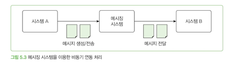

기본적인 처리 과정은 다음과 같다.

1. 시스템 A가 전달할 데이터를 메시지로 만든다.
2. 메시지를 메시징 시스템에 전송한다.
3. 메시징 시스템이 메시지를 보관한다.
4. 시스템 B가 메시지를 받아 필요한 작업을 처리한다.

시스템 A는 시스템 B의 처리가 끝날 때까지 기다리지 않는다.

---

### 메시징 시스템을 사용하는 이유

#### 시스템 간 장애 격리

시스템 A가 시스템 B를 직접 호출하면 B의 응답 지연이나 장애가 A까지 전파된다.

메시징 시스템을 사용하면 메시지를 중간에 보관할 수 있다. 시스템 A의 트래픽이 급증해도 시스템 B는 자신의 처리량에 맞춰 메시지를 처리한다.

즉, 메시징 시스템은 트래픽의 차이를 흡수하는 **버퍼** 역할을 한다.

다만 버퍼의 용량은 무한하지 않다. 소비자가 계속 메시지를 처리하지 못하면 메시지가 쌓이고 결국 생산자에게도 영향을 줄 수 있다.

### 소비자 확장이 쉽다

시스템 A의 데이터를 새로운 시스템 C에서도 사용해야 한다고 가정하자.

직접 연동 구조에서는 시스템 A가 시스템 C를 호출하도록 코드를 수정해야 한다. 메시징 구조에서는 시스템 C가 기존 메시지를 구독하도록 연결하면 된다.

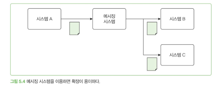

생산자는 소비자가 몇 개인지 알 필요가 없다. 덕분에 시스템 간 결합도가 낮아지고 새로운 소비자를 추가하기 쉬워진다.

---

### 생산자와 소비자

메시징 시스템에서는 다음 용어를 사용한다.

- **생산자(Producer)**: 메시지를 생성해 메시징 시스템으로 보내는 쪽
- **소비자(Consumer)**: 메시지를 받아 처리하는 쪽
- **게시자(Publisher)**: 게시·구독 구조에서 메시지를 게시하는 쪽
- **구독자(Subscriber)**: 게시된 메시지를 구독하고 처리하는 쪽

`Producer/Consumer`는 메시지의 생산과 처리를 강조하고, `Publisher/Subscriber`는 하나의 메시지를 여러 구독자가 받을 수 있는 구조를 강조한다.

---

### 메시징 기술 비교

대표적인 메시징 기술로 Kafka, RabbitMQ, Redis Pub/Sub이 있다.

| 구분 | Kafka | RabbitMQ | Redis Pub/Sub |
|---|---|---|---|
| 주 용도 | 대규모 이벤트 스트림과 로그 처리 | 작업 큐와 복잡한 메시지 라우팅 | 실시간 알림과 단순 방송 |
| 메시지 저장 | 디스크에 일정 기간 보관 | 설정에 따라 영속화 가능 | 기본적으로 저장하지 않음 |
| 전달 방식 | 소비자가 읽는 Pull 방식 | 브로커가 전달하는 Push 방식 | 게시 즉시 구독자에게 전달 |
| 재처리 | 오프셋을 이용해 가능 | 재전달과 재처리 가능 | 불가능 |
| 순서 | 파티션 내부에서 보장 | 큐의 전달 순서를 유지하지만 병렬 처리 시 완료 순서는 달라질 수 있음 | 게시된 순서대로 전달 |
| 장점 | 높은 처리량, 수평 확장, 메시지 재처리 | ACK, 라우팅, 다양한 프로토콜과 패턴 지원 | 구조가 단순하고 지연 시간이 짧음 |
| 주의점 | 운영 복잡도가 높음 | 소비자가 느리면 큐에 메시지가 쌓임 | 구독자가 없거나 연결이 끊기면 메시지 유실 |

#### 선택 기준

- 대규모 이벤트를 오래 보관하고 재처리해야 한다면 Kafka를 고려한다.
- 메시지를 정확한 대상에게 전달하거나 작업 큐와 복잡한 라우팅이 필요하다면 RabbitMQ를 고려한다.
- 메시지 유실이 허용되고 실시간 전달과 단순한 구조가 중요하다면 Redis Pub/Sub을 고려한다.
- 직접 운영하기 어렵다면 AWS SQS 같은 클라우드 메시징 서비스도 선택할 수 있다.

기술의 기능만큼 조직의 운영 경험도 중요하다. 유행이나 개인적인 호기심만으로 기술을 선택하면 장기적으로 유지보수 비용이 커질 수 있다.

> 가장 유명한 기술보다 요구사항을 만족하면서 조직이 안정적으로 운영할 수 있는 기술을 선택해야 한다.

---

### 생산자가 고려할 사항

#### 메시지 전송 실패

생산자와 메시징 시스템 사이의 네트워크 문제로 메시지 전송에 실패하거나 타임아웃이 발생할 수 있다.

대응 방법은 크게 세 가지다.

1. 실패를 무시한다.
2. 메시지 전송을 재시도한다.
3. 실패 내역을 기록하고 나중에 처리한다.

로그나 단순 알림처럼 일부 유실이 허용되는 메시지는 무시할 수 있다. 주문이나 결제처럼 중요한 메시지는 재시도하거나 실패 내역을 반드시 저장해야 한다.

#### 재시도로 인한 중복 메시지

생산자는 메시지를 전송했지만 응답을 받지 못하면 실패했다고 판단할 수 있다. 이 상태에서 재시도하면 같은 메시지가 두 번 전송된다.

따라서 메시지마다 고유한 식별자를 부여해야 한다.

```json
{
  "messageId": "order-created-10001",
  "type": "ORDER_CREATED",
  "orderId": 10001
}
```

같은 메시지를 다시 전송할 때는 새로운 ID를 만들지 않고 기존 `messageId`를 유지한다. 그래야 소비자가 중복 메시지를 구분할 수 있다.

---

### DB 트랜잭션과 메시지 전송

DB 변경과 메시지 전송을 함께 처리할 때는 실행 순서에 주의해야 한다.

#### 커밋 전에 메시지를 보내는 경우

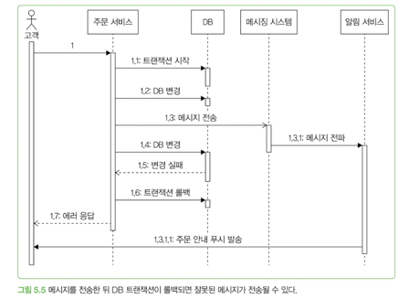

다음과 같은 문제가 발생할 수 있다.

1. 주문 정보를 DB에 저장한다.
2. 주문 완료 메시지를 전송한다.
3. 이후 DB 변경에 실패한다.
4. 트랜잭션이 롤백된다.
5. 이미 전송된 메시지는 취소되지 않는다.
6. 고객은 주문에 실패했지만 주문 완료 알림을 받는다.

DB 트랜잭션과 메시징 시스템은 기본적으로 서로 다른 자원이므로 DB 롤백만으로 전송된 메시지를 취소할 수 없다.

### 커밋 후 메시지를 보내는 경우

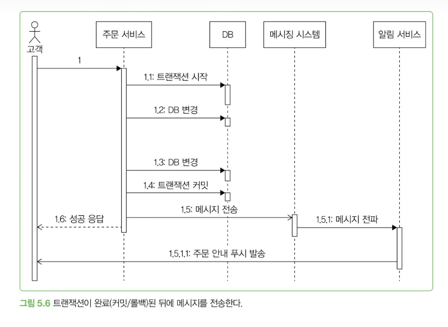

잘못된 메시지 전송을 막으려면 DB 트랜잭션이 성공적으로 커밋된 뒤 메시지를 전송해야 한다.

하지만 이 방법도 완전하지 않다.

1. DB 트랜잭션은 커밋된다.
2. 애플리케이션이 메시지를 보내기 전에 종료된다.
3. DB에는 주문이 있지만 주문 완료 메시지는 전송되지 않는다.

즉, 다음 두 문제를 모두 고려해야 한다.

- 커밋되지 않은 데이터를 메시지로 보내는 문제
- 커밋은 됐지만 메시지가 전송되지 않는 문제

이 문제를 줄이기 위해 트랜잭션 아웃박스 패턴을 사용할 수 있다.

---

### 글로벌 트랜잭션과 2PC

글로벌 트랜잭션은 DB 변경과 메시지 전송처럼 여러 자원의 작업을 하나의 트랜잭션으로 묶는다. 주로 2단계 커밋(2PC)을 사용한다.

DB 변경이나 메시지 전송 중 하나가 실패하면 전체 작업을 롤백할 수 있다는 장점이 있다. 하지만 참여 자원 간 조율 과정이 추가되므로 처리 속도가 느려지고 시스템의 결합도도 높아진다.

> 글로벌 트랜잭션이 반드시 필요한 상황이 아니라면 DB와 메시징 시스템을 강하게 묶지 않는다.

DB 변경 이후 메시지를 최대한 유실 없이 보내야 한다면 일반적으로 트랜잭션 아웃박스 패턴을 검토한다.

---

### 소비자가 고려할 사항

#### 중복 메시지 처리

소비자는 다음과 같은 이유로 같은 메시지를 여러 번 받을 수 있다.

- 생산자가 전송 결과를 확인하지 못해 같은 메시지를 다시 전송한 경우
- 소비자가 메시지를 처리한 뒤 ACK를 보내기 전에 장애가 발생한 경우
- 소비 중 오류가 발생해 메시징 시스템이 메시지를 다시 전달한 경우

따라서 소비자는 메시지가 중복될 수 있다고 가정해야 한다.

```java
ConsumerRecords<String, String> records =
        consumer.poll(Duration.ofMillis(100));

for (ConsumerRecord<String, String> record : records) {
    Message message = messageConverter.convert(record.value());

    if (checkAlreadyHandled(message.getId())) {
        continue;
    }

    handle(message);
    recordHandledLog(message.getId());
}
```

처리한 메시지 ID를 DB나 캐시에 기록하면 이미 처리한 메시지를 무시할 수 있다.

이때 중요한 점은 `handle()`과 처리 완료 기록 사이에서도 장애가 발생할 수 있다는 것이다. 가능하면 실제 비즈니스 처리와 메시지 처리 기록을 같은 DB 트랜잭션으로 묶어야 한다.

#### 멱등성 확보

외부 API를 호출한 뒤 읽기 타임아웃이 발생하면 실제 작업은 성공했을 수도 있다. 이 상태에서 메시지를 다시 처리하면 외부 API가 중복 호출된다.

따라서 같은 요청을 여러 번 실행해도 결과가 달라지지 않도록 멱등성을 확보해야 한다.

예를 들어 포인트 지급 요청에 `messageId`를 함께 전달하고, 이미 처리한 ID라면 포인트를 다시 지급하지 않도록 구현할 수 있다.

#### 처리 상태 모니터링

소비자의 처리 속도가 생산 속도보다 느리면 메시지가 계속 쌓인다. 메시지 처리 지연이 커지면 비동기 기능이 사용자에게 늦게 반영된다.

다음 항목을 모니터링해야 한다.

- 대기 중인 메시지 수
- 소비 지연 시간 또는 Consumer Lag
- 메시지 처리 속도
- 실패와 재시도 횟수
- 장시간 처리되지 않은 메시지

---

### 이벤트와 커맨드

메시지는 크게 이벤트와 커맨드로 나눌 수 있다.

| 이벤트 | 커맨드 |
|---|---|
| 주문이 생성됨 | 포인트 지급하기 |
| 로그인에 실패함 | 로그인 차단하기 |
| 상품 정보가 조회됨 | 배송 완료 문자 발송하기 |
| 배송이 완료됨 | 주문 상태 변경하기 |

#### 이벤트

이벤트는 **이미 발생한 사실**을 표현한다.

- 주문이 생성됨
- 로그인이 실패함
- 배송이 완료됨

이벤트는 특정 소비자에게 작업을 명령하지 않는다. 해당 사건에 관심 있는 소비자가 구독해 각자 필요한 작업을 결정한다.

예를 들어 `배송이 완료됨` 이벤트를 다음 서비스들이 각각 사용할 수 있다.

- 알림 서비스: 배송 완료 문자 발송
- 주문 서비스: 주문 상태 변경
- 분석 서비스: 배송 소요 시간 기록

이벤트는 새로운 소비자를 추가하기 쉬우므로 시스템 확장에 유리하다.

#### 커맨드

커맨드는 **특정 작업의 실행을 요청**한다.

- 포인트 지급하기
- 로그인 차단하기
- 배송 완료 문자 발송하기

커맨드는 수행할 기능과 대상이 명확하다. `포인트 지급하기` 커맨드는 포인트 서비스가 처리해야 하며, 다른 서비스가 받아도 의미가 없다.

#### 차이 정리

| 구분 | 이벤트 | 커맨드 |
|---|---|---|
| 의미 | 발생한 사실 | 실행할 작업 |
| 표현 | 과거형 | 명령형 |
| 수신자 | 정해져 있지 않음 | 명확하게 정해짐 |
| 확장성 | 여러 소비자가 자유롭게 구독 | 특정 소비자가 처리 |
| 예시 | `OrderCreated` | `GivePoint` |

---

### 궁극적 일관성

비동기 메시징에서는 생산자의 데이터 변경이 소비자에게 즉시 반영되지 않는다.

예를 들어 배송 서비스가 배송 상태를 `배송 완료`로 변경해도, 주문 서비스가 해당 이벤트를 처리하기 전까지는 주문 상태가 `배송 중`으로 남아 있을 수 있다.

이처럼 일시적으로 데이터가 불일치하지만 메시지가 정상적으로 처리된 뒤 최종적으로 상태가 일치하는 특성을 **궁극적 일관성(Eventual Consistency)**이라고 한다.

비동기 연동을 사용할 때는 다음을 함께 결정해야 한다.

- 어느 정도의 반영 지연을 허용할 것인가?
- 메시지 처리에 실패하면 어떻게 재시도할 것인가?
- 끝까지 처리되지 않은 메시지를 어떻게 복구할 것인가?
- 일시적인 데이터 불일치를 사용자에게 어떻게 보여 줄 것인가?

### 핵심 정리

> 메시징 시스템은 생산자와 소비자를 분리해 장애 전파를 줄이고 확장을 쉽게 만들지만, 메시지 유실·중복·순서·트랜잭션·처리 지연을 직접 관리해야 한다.

특히 다음 세 가지가 핵심이다.

1. 메시지는 유실되거나 중복될 수 있다고 가정한다.
2. 소비자는 멱등하게 구현한다.
3. DB 변경과 메시지 전송 사이의 불일치는 트랜잭션 아웃박스 같은 패턴으로 해결한다.

---

## 5.3 트랜잭션 아웃박스 패턴

DB 트랜잭션이 끝난 뒤 메시지를 전송하더라도 메시지 유실 가능성은 남아 있다.

```text
DB 커밋 성공
    ↓
애플리케이션 장애 발생
    ↓
메시지 전송 실패
```

DB에는 데이터가 반영됐지만 메시지는 전송되지 않는 문제가 발생할 수 있다. 재시도와 예외 처리를 추가해도 프로세스가 갑자기 종료되면 메시지 데이터 자체가 사라질 수 있다.

이를 해결하기 위해 사용하는 방법이 **트랜잭션 아웃박스 패턴(Transactional Outbox Pattern)**이다.

> 업무 데이터와 전송할 메시지를 하나의 DB 트랜잭션으로 함께 저장한 뒤, 별도 중계기가 메시지를 전송한다.

---

### 동작 과정

트랜잭션 아웃박스 패턴은 하나의 DB 트랜잭션에서 다음 작업을 처리한다.

1. 실제 업무 데이터를 변경한다.
2. 전송할 메시지를 아웃박스 테이블에 저장한다.
3. 두 작업을 함께 커밋한다.
4. 별도의 메시지 중계기가 아웃박스 테이블을 조회한다.
5. 대기 중인 메시지를 메시징 시스템에 전송한다.
6. 전송에 성공하면 완료 상태로 변경한다.

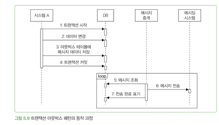

업무 데이터와 메시지가 같은 트랜잭션에 포함되므로 다음 결과가 보장된다.

| 업무 데이터 변경 | 아웃박스 메시지 저장 | 결과 |
|---|---|---|
| 커밋 | 커밋 | 메시지 전송 대상이 됨 |
| 롤백 | 롤백 | 메시지가 전송되지 않음 |

따라서 커밋되지 않은 업무에 대한 잘못된 메시지가 전송되는 것을 막을 수 있다.

---

### 메시지 중계기

메시지 중계기는 아웃박스 테이블을 주기적으로 조회해 메시징 시스템으로 전송한다.

```java
public void processMessages() {
    List<MessageData> waitingMessages = selectWaitingMessages();

    for (MessageData message : waitingMessages) {
        try {
            sendMessage(message);
            markDone(message.getId());
        } catch (Exception exception) {
            handleError(message, exception);
            break;
        }
    }
}
```

처리 과정은 다음과 같다.

1. `WAITING` 상태의 메시지를 순서대로 조회한다.
2. 메시징 시스템에 전송한다.
3. 성공하면 `DONE`으로 변경한다.
4. 실패하면 실패 횟수와 원인을 기록한다.
5. 재시도하거나 일정 횟수 이후 `FAILED`로 변경한다.

---

### 메시지 순서

메시지를 생성된 순서대로 전송해야 한다면 중간 메시지에서 실패했을 때 처리를 멈춰야 한다.

```text
1번 성공 → 2번 성공 → 3번 실패 → 처리 중단
```

3번이 실패했는데 4번부터 계속 전송하면 메시지 생성 순서와 실제 전송 순서가 달라진다.

다만 하나의 실패 메시지가 이후 메시지를 계속 막을 수 있다. 따라서 다음 정책을 함께 정해야 한다.

- 메시지 순서가 정말 필요한가?
- 몇 번까지 재시도할 것인가?
- 언제 `FAILED`로 변경하고 다음 메시지를 처리할 것인가?
- 실패 메시지를 어떻게 복구할 것인가?

모든 메시지에 전역 순서가 필요한 것은 아니다. 주문별·사용자별 순서처럼 특정 대상 안에서만 순서가 필요한 경우도 많다.

---

### 전송 완료 기록 방법

#### 상태 칼럼 사용

아웃박스 테이블에 메시지 상태를 기록한다.

```sql
SELECT *
FROM outbox
WHERE status = 'WAITING'
ORDER BY id ASC
LIMIT 100;
```

전송에 성공하면 상태를 변경한다.

```sql
UPDATE outbox
SET status = 'DONE',
    processedAt = CURRENT_TIMESTAMP
WHERE id = ?;
```

상태 칼럼을 사용하면 대기·완료·실패 메시지 수를 쉽게 확인할 수 있어 모니터링하기 좋다.

#### 마지막 처리 ID 기록

중계기가 마지막으로 전송한 메시지 ID를 별도 테이블이나 파일에 저장하는 방법도 있다.

```sql
SELECT *
FROM outbox
WHERE id > :lastProcessedId
ORDER BY id ASC
LIMIT 100;
```

메시지 전송이 끝나면 `lastProcessedId`를 갱신한다. 여러 중계기가 각각 독립적으로 메시지를 처리해야 한다면 중계기별로 마지막 처리 ID를 관리할 수 있다.

---

### 아웃박스 테이블 구조

사진으로 나뉜 두 표를 하나로 합치면 다음과 같다.

| 칼럼 | 타입 | 설명 |
|---|---|---|
| `id` | `BIGINT` | 단순 증가 기본 키. 메시지 저장 순서를 판단하는 데 사용 |
| `messageId` | `VARCHAR` | 메시지 고유 ID. 중복 메시지 판별에 사용 |
| `messageType` | `VARCHAR` | 메시지 종류. 예: `LoginFailed`, `OrderPlaced` |
| `payload` | `CLOB` | 실제 메시지 데이터. 주로 JSON이나 XML 형식 사용 |
| `status` | `VARCHAR` | 처리 상태: `WAITING`, `DONE`, `FAILED` |
| `failCount` | `INT` | 메시지 전송 실패 횟수 |
| `occurredAt` | `TIMESTAMP` | 메시지가 발생한 시간 |
| `processedAt` | `TIMESTAMP` | 메시지 전송을 완료한 시간 |
| `failedAt` | `TIMESTAMP` | 마지막으로 전송에 실패한 시간 |


#### 메시지 상태

```text
WAITING  → 전송 대기
DONE     → 전송 완료
FAILED   → 반복 실패로 전송 중단
EXCLUDED → 운영자가 전송 대상에서 제외
```

전송에 한 번 실패했다고 바로 `FAILED`로 바꾸지는 않는다. 일시적인 네트워크 문제라면 재시도를 통해 성공할 수 있기 때문이다.

예를 들어 다음과 같은 정책을 사용할 수 있다.

```text
1~4회 실패 → WAITING 상태로 재시도
5회 실패   → FAILED로 변경
FAILED 발생 → 모니터링 알림 전송
운영자 확인 → 재처리 또는 EXCLUDED 처리
```

실패 메시지를 방치하면 시스템 간 데이터 일관성이 깨질 수 있으므로 반드시 후속 처리 방법을 마련해야 한다.

---

### 중복 전송 가능성

트랜잭션 아웃박스 패턴이 메시지 중복까지 완전히 막아 주는 것은 아니다.

```text
메시지 전송 성공
    ↓
DONE 상태로 변경하기 전에 중계기 종료
    ↓
다음 실행에서 같은 메시지 재전송
```

메시징 시스템으로 전송하는 작업과 아웃박스 상태를 `DONE`으로 변경하는 작업은 하나의 트랜잭션이 아니기 때문이다.

따라서 아웃박스 패턴은 일반적으로 **최소 한 번 전송(At-least-once)**을 전제로 한다.

이를 안전하게 처리하려면 다음 조건이 필요하다.

- 메시지마다 고유한 `messageId`를 부여한다.
- 재시도할 때 기존 `messageId`를 유지한다.
- 소비자가 이미 처리한 메시지인지 확인한다.
- 소비자의 작업을 멱등하게 구현한다.

> 아웃박스는 메시지 유실 가능성을 줄이지만, 중복 전송 가능성은 소비자가 처리해야 한다.

---

### 장점과 단점

#### 장점

- 업무 데이터와 메시지 데이터를 원자적으로 저장할 수 있다.
- DB 롤백 시 메시지도 함께 롤백된다.
- 메시징 시스템 장애가 발생해도 메시지가 DB에 남는다.
- 실패한 메시지를 재시도하거나 수동으로 복구할 수 있다.
- 글로벌 트랜잭션이나 2PC 없이 데이터 정합성을 높일 수 있다.

#### 단점

- 아웃박스 테이블과 메시지 중계기를 추가해야 한다.
- 메시지가 즉시 전송되지 않고 약간의 지연이 발생한다.
- 아웃박스 데이터 정리 정책이 필요하다.
- 중복 전송 가능성이 남는다.
- 여러 중계기가 동시에 처리하면 동시성 제어가 필요하다.
- 실패 메시지에 대한 모니터링과 운영 절차가 필요하다.

---

### 핵심 정리

> 트랜잭션 아웃박스 패턴은 업무 데이터와 메시지를 같은 DB 트랜잭션으로 저장해 메시지 유실과 잘못된 전송을 줄이는 패턴이다.

핵심 흐름은 다음과 같다.

```text
업무 데이터 변경
    +
아웃박스 메시지 저장
    ↓
하나의 트랜잭션으로 커밋
    ↓
별도 중계기가 메시지 전송
    ↓
성공·실패 상태 기록
```

다만 메시지 전송과 완료 처리는 원자적이지 않으므로 중복 전송이 발생할 수 있다. 따라서 **트랜잭션 아웃박스 패턴과 소비자의 멱등성 처리는 함께 설계해야 한다.**

---

## 5.4 배치 전송

배치 전송은 데이터를 비동기로 연동하는 전통적인 방법이다. 메시징 시스템이 데이터를 거의 실시간으로 전달한다면, 배치는 데이터를 모아 일정한 간격으로 전달한다.

예를 들면 다음과 같다.

- 결제 승인 데이터를 모아 다음 날 전송한다.
- 택배 발송 요청 데이터를 1시간 간격으로 전송한다.

### 기본 처리 과정

파일을 이용한 배치 전송은 일반적으로 다음 순서로 동작한다.

1. DB에서 전송할 데이터를 조회한다.
2. 조회한 데이터를 파일로 생성한다.
3. 파일을 연동 시스템에 전송한다.

파일 전송에는 FTP, SFTP 같은 프로토콜이나 SCP 같은 명령어를 사용한다.

### 파일 형식

배치 파일에서는 주로 다음 형식을 사용한다.

| 형식 | 예시 | 특징 |
|---|---|---|
| 구분자 형식 | `값1^값2^값3` | 구조가 단순하고 파싱 속도가 빠름 |
| 이름-값 형식 | `이름1=값1^이름2=값2` | 값의 위치와 관계없이 의미를 알 수 있지만 데이터 크기가 커짐 |
| JSON 형식 | `{"id": 1, "name": "사용자"}` | 구현하기 쉽지만 부가 문자가 많아 데이터 크기가 커짐 |

#### 구분자 형식

```text
아이디^이름^이메일^전화번호
```

각 값의 위치에 따라 의미가 결정된다. 예를 들어 첫 번째 값은 아이디, 두 번째 값은 이름으로 정할 수 있다.

구분자로는 값에 포함될 가능성이 낮은 `^`나 탭 문자를 주로 사용한다. 형식이 단순해 구현과 파싱이 빠르다.

#### 이름-값 형식

```text
id=1^name=홍길동^email=user@example.com
```

이름과 값을 한 쌍으로 표현하므로 위치와 관계없이 각 값의 의미를 알 수 있다. 대신 이름까지 포함해야 하므로 구분자 형식보다 데이터 크기가 커진다.

#### JSON 형식

```json
{"id": 1, "name": "홍길동", "email": "user@example.com"}
```

각 줄을 JSON 형식으로 기록한다. 대부분의 프로그래밍 언어가 JSON 변환 기능을 제공하므로 구현하기 쉽다.

다만 프로퍼티 이름, 쉼표, 큰따옴표, 콜론 등이 포함되므로 데이터 크기가 커진다.

### 파일 연동 시 협의할 항목

파일로 데이터를 주고받을 때는 형식뿐만 아니라 다음 항목도 정해야 한다.

- 송수신 주체
- 전송 시간
- 저장 경로와 파일 이름

#### 송수신 주체

생산자가 소비자에게 파일을 업로드할지, 소비자가 생산자의 파일을 다운로드할지 미리 협의해야 한다.

생산자가 소비자의 환경에 파일을 업로드하는 방식은 소비자 입장에서 편리하다. 결제 서비스 업체가 결제 내역 파일을 고객 시스템에 직접 올려 주는 것이 대표적인 예다.

반대로 소비자가 직접 다운로드하는 방식을 선호할 수도 있다. 생산자가 파일을 업로드하려면 소비자 시스템을 외부에 노출해야 하는데, 보안 정책상 외부 노출이 어려울 수 있기 때문이다.

VPN이나 전용선을 구성할 수도 있지만, 상황에 따라 이 방법도 사용하기 어려울 수 있다.

#### 전송 시간

소비자가 데이터를 필요로 하는 시점보다 먼저 파일을 전송해야 한다.

예를 들어 매월 5일까지 정산을 마쳐야 한다면 그전에 월 단위 데이터를 전달해야 한다. 정해진 시간까지 데이터가 도착하지 않으면 소비자의 업무가 지연된다.

오류에 대응할 시간을 확보하기 위해 근무가 시작되는 오전 시간대에 파일을 전송하기도 한다. 생산자가 글로벌 서비스라면 서로 다른 시간대도 고려해야 한다.

#### 경로와 파일 이름

한 시스템이 여러 서비스로부터 파일을 받는다면 저장 경로나 파일 이름이 충돌하지 않도록 규칙을 정해야 한다.

```text
/data/orders/order_20260810.txt
/data/payments/payment_20260810.txt
```

### 소비자의 파일 처리

생산자가 소비자에게 파일을 업로드한다면 소비자는 일반적으로 다음 순서로 처리한다.

1. 지정한 경로에 파일이 있는지 확인한다.
2. 파일이 있으면 데이터를 읽는다.
3. 파일이 없으면 정해진 후처리를 수행한다.
4. 읽은 데이터를 시스템에 반영한다.
5. 처리가 끝난 파일을 다른 폴더로 이동한다.

생산자가 오전 8시에 파일을 업로드한다면 소비자는 오전 8시 30분에 파일을 처리하도록 구성할 수 있다.

처리가 끝난 파일은 바로 삭제하지 않고 별도 폴더로 이동한다.

```text
/input   → 처리 전 파일
/archive → 처리 완료 파일
```

이렇게 하면 같은 파일이 중복 처리되는 것을 막을 수 있고, 문제가 발생했을 때 보관된 파일을 이용해 다시 처리할 수 있다.

### 파일 이외의 배치 연동 방법

#### API를 이용한 일괄 전송

파일 대신 API를 호출해 데이터를 한꺼번에 전송할 수도 있다.

API를 사용하면 파일 생성, 전송, 처리 과정이 없어 구현이 단순해진다. 데이터 크기가 작거나 처리할 항목이 적을 때 고려할 수 있다.

#### 읽기 전용 DB 제공

같은 조직 안에서 데이터를 전달할 때는 소비자에게 DB 읽기 권한을 제공할 수 있다.

소비자는 생산자의 DB에서 필요한 데이터를 직접 조회한다. 외부 연동보다 보안 요구가 낮고 개발 시간이 부족할 때 선택할 수 있는 방법이다.

#### DB를 통한 직접 연동

레거시 시스템은 API나 파일 대신 DB 테이블을 이용해 연동하기도 한다.

예를 들어 배송 요청 테이블에 데이터를 추가하면 택배 시스템이 이를 처리하고, 배송 상태가 바뀔 때마다 변경 내역 테이블에 데이터를 추가할 수 있다.

외부 시스템의 DB에 직접 접근하는 방식이 어색할 수 있지만, 테이블 구조를 API 명세라고 생각할 수 있다. 연동 구현 방식만 다를 뿐이다.

### 재처리 기능

파일 생성이나 네트워크 문제로 배치 전송이 실패할 수 있다. 따라서 자동 재시도와 수동 재처리 기능을 함께 마련해야 한다.

#### 자동 재시도

배치가 정상적으로 완료됐는지 확인하고 실패했다면 다시 실행한다.

예를 들어 오전 7시에 시작한 배치가 평균 20분 걸린다면 오전 7시 40분에 실행 결과를 확인할 수 있다. 실패했다면 한두 번 다시 실행한다.

자동 재시도만으로도 수동 처리해야 하는 상황을 크게 줄일 수 있다.

#### 수동 재처리

자동 재시도 이후에도 실패할 수 있다.

소비자가 오전 9시 30분과 10시 30분에만 파일을 확인하는데 생산자가 오후 2시에 파일을 전송하면 자동으로 처리되지 않는다.

이런 상황에 대비해 운영자가 배치를 직접 실행할 수 있는 명령어나 API를 만들어 둔다.

```text
POST /admin/batches/{batchId}/retry
```

문제가 발생했을 때 빠르게 배치를 재실행할 수 있어야 한다.

### 전송할 데이터가 없는 경우

전송할 데이터가 없더라도 빈 파일을 보내는 것이 좋다.

파일이 전달되지 않으면 소비자는 다음 두 상황을 구분할 수 없다.

- 전송할 데이터가 없어서 파일이 없는 경우
- 오류가 발생해 파일이 전송되지 않은 경우

빈 파일을 보내면 배치가 정상적으로 실행됐지만 전송할 데이터가 없었다는 사실을 명확하게 알 수 있다.

### 핵심 정리

배치 전송에서는 다음 항목을 명확하게 정해야 한다.

- 파일 형식
- 업로드와 다운로드 주체
- 전송 및 처리 시간
- 저장 경로와 파일 이름
- 처리 완료 파일의 보관 방법
- 자동 재시도와 수동 재처리 방법
- 전송할 데이터가 없을 때의 처리 방식

---

## 5.5 CDC(Change Data Capture)

CDC는 변경된 데이터를 추적하고 식별해 해당 데이터로 작업을 수행할 수 있게 하는 소프트웨어 설계 패턴이다.

Oracle이나 MySQL 같은 DBMS는 데이터 변경 내용을 알리는 기능을 제공한다. CDC는 이 기능을 이용해 변경된 데이터를 다른 시스템에 전달한다.

### CDC 처리 흐름

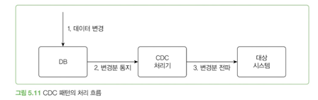

CDC는 다음 순서로 동작한다.

1. `INSERT`, `UPDATE`, `DELETE` 쿼리로 DB 데이터가 변경된다.
2. DB가 변경 내용을 CDC 처리기에 전달한다.
3. CDC 처리기가 데이터를 확인하고 가공한다.
4. 변경 데이터를 대상 시스템에 전달한다.

DB는 커밋된 데이터만 변경된 순서에 맞게 전달한다. 롤백된 데이터는 CDC 처리기에 전달되지 않는다.

변경 데이터는 레코드 단위로 전달된다. 예를 들어 레코드 1개를 추가하고, 2개를 수정하고, 3개를 삭제했다면 총 6개 레코드의 변경 내용이 전달된다.

변경 데이터에는 다음 정보가 포함된다.

- 추가·수정·삭제를 구분하는 값
- 변경된 레코드
- 수정 전 데이터
- 수정 후 데이터

수정 전후 데이터를 비교하면 어떤 칼럼이 어떻게 변경됐는지 확인할 수 있다.

### 변경 데이터 전달 방식

CDC 처리기는 변경 데이터를 대상 시스템에 두 가지 방식으로 전달한다.

1. 변경 데이터를 그대로 전달한다.
2. 변경 데이터를 가공하거나 변환해 전달한다.

#### 변경 데이터를 그대로 전달

두 시스템의 데이터가 거의 일대일 관계라면 변경 데이터를 그대로 전달할 수 있다.

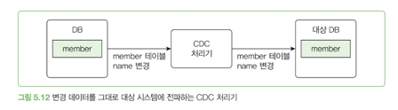

예를 들어 회원 시스템의 회원 데이터를 콘텐츠 시스템의 회원 테이블에 동기화할 수 있다.

회원 시스템에서 `member` 테이블의 `name` 칼럼을 변경하면 콘텐츠 시스템의 `member` 테이블에도 같은 변경 내용을 반영한다.

#### 변경 데이터를 변환해 전달

대상 시스템에 전체 변경 데이터가 필요하지 않다면 필요한 데이터만 가공해 전달할 수 있다.


예를 들어 주문이 생성되거나 주문 상태가 `배송 중`으로 변경됐다고 하자. 통지 시스템에는 주문 데이터 전체가 아닌 주문 ID와 변경된 상태만 전달하면 된다.

```text
주문 DB 변경
    ↓
CDC 처리기
    ↓
(주문 ID, 주문 상태)
    ↓
통지 시스템
```

### 변경 데이터 전달 대상

CDC 처리기는 목적에 따라 DB, 메시징 시스템, API 등 다양한 대상으로 데이터를 전달할 수 있다.

#### DB로 전달

두 시스템의 데이터를 동기화하는 것이 목적이라면 DB 사이에 CDC를 두어 데이터를 복제할 수 있다.

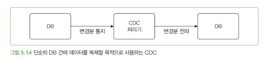

```text
DB → 변경 내용 통지 → CDC 처리기 → 변경 내용 전달 → 대상 DB
```

#### 메시징 시스템으로 전달

메시징 시스템으로 변경 데이터를 전달하면 여러 소비자가 같은 데이터를 사용할 수 있다.

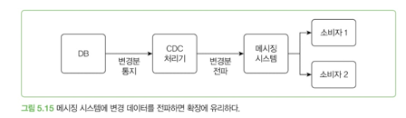

```text
DB
 ↓
CDC 처리기
 ↓
메시징 시스템
 ├─ 소비자 1
 └─ 소비자 2
```

새로운 소비자가 필요하면 메시징 시스템에 연결하면 되므로 확장하기 쉽다.

### CDC와 이벤트의 차이

CDC는 데이터 변경 내용을 전달한다는 점에서 이벤트 메시지와 비슷하다. 하지만 이벤트처럼 발생한 일의 의미를 정확하게 표현하지는 못한다.

다음 이벤트는 발생한 일을 명확하게 나타낸다.

```text
회원 암호를 초기화함
```

반면 CDC가 전달하는 데이터는 다음과 같다.

```text
회원 테이블의 암호 칼럼 변경
- 이전 암호
- 이후 암호
```

이 정보만으로는 회원이 직접 암호를 변경했는지, 시스템이 암호를 초기화했는지 알기 어렵다.

암호를 변경한 주체를 나타내는 칼럼이 있다면 여러 칼럼의 변경 내용을 조합해 의미를 간접적으로 판단할 수 있다.

### CDC 처리 위치 기록

CDC 처리기는 변경 데이터를 어디까지 처리했는지 기록해야 한다.

MySQL은 바이너리 로그를 이용해 CDC를 구현한다. 각 로그 항목은 변경 데이터와 로그 파일 안에서의 위치 값을 가진다.

CDC 처리기는 마지막으로 처리한 위치를 저장한다.

```text
바이너리 로그 읽기
    ↓
변경 데이터 처리
    ↓
마지막 처리 위치 저장
```

CDC 처리기를 재시작하면 저장된 위치부터 다시 로그를 읽는다.

마지막 처리 위치를 기록하지 않고 최신 로그부터 읽으면 CDC 처리기가 중단된 동안 발생한 변경 데이터를 놓칠 수 있다.

### CDC가 유용한 경우

기존 시스템의 코드가 복잡하거나 일정이 부족해 연동 코드를 추가하기 어렵다면 CDC를 활용할 수 있다.

예를 들어 신규 주문 시스템의 데이터를 기존 주문 시스템과 콘텐츠 서비스에 전달해야 하는 상황을 생각할 수 있다.

신규 주문 시스템의 코드를 직접 수정하는 대신 DB 변경 내용을 CDC 처리기가 읽어 Kafka에 전달한다. 각 소비자는 Kafka에서 필요한 메시지를 읽어 자신의 시스템에 반영한다.

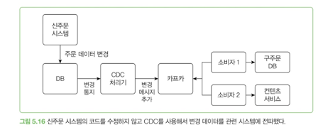

연동 대상 시스템마다 데이터 처리 속도가 다르다면 중간에 Kafka 같은 메시징 시스템을 둘 수 있다.

이 구조를 사용하면 신규 주문 시스템의 코드를 수정하지 않고 관련 시스템에 데이터를 전달할 수 있다. 따라서 신규 시스템의 개발 일정에 미치는 영향을 줄일 수 있다.

### 비동기 연동을 선택할 때

현실의 많은 작업은 비동기로 처리된다.

- 이메일을 받자마자 답장할 필요는 없다.
- 업무 메시지를 받은 즉시 처리하지 못할 수 있다.
- 커피 주문을 여러 개 받은 뒤 한꺼번에 만들 수도 있다.

시스템 연동도 비슷하다. 생각보다 많은 기능을 비동기로 구현할 수 있다.

비동기 연동은 구조가 복잡해지고 시스템 사이의 데이터가 일시적으로 불일치할 수 있다는 단점이 있다. 반면 성능, 안정성, 자율성 측면에서는 유리할 수 있다.

모든 연동을 비동기로 구현할 필요는 없다. 복잡도 증가보다 얻는 이점이 더 크다면 비동기 연동을 고려한다.

---
