# 8장 실무에서 꼭 필요한 보안 지식

## 30초 요약

- 대형 보안 사고는 정교한 해킹이 아니라 **인가 검사 한 줄을 빼먹어서** 터진다
- 인증 방식은 **"토큰 데이터를 어디에 두느냐"** 로 갈린다 (서버 메모리 / 외부 저장소 / 토큰 자체)
- 쿠키냐 헤더냐는 **XSS와 CSRF 중 무엇이 위협인지**로 결정 — 웹은 쿠키, 앱은 헤더
- 암호화는 **되돌려야 하는가**로 갈린다: 비밀번호는 단방향, 주민번호·카드번호는 양방향
- 모든 방식에서 **비밀은 딱 하나**(키 / 개인 키). 솔트·IV·공개 키는 공개돼도 안전해야 한다
- 서버 개발자가 할 일은 인증·인가·암호화·방화벽·감사 로그의 **기본을 빠짐없이 하는 것**

---

## 8.1 중요한 보안 (p.212-213)

**사례 1 — K사, 1천만 건 유출**

요금 정보 조회 API가 고객 코드를 파라미터로 받았다.

```
https://주소/...?cd=고객 코드
```

| 문제 | 서버가 **그 코드가 로그인한 사용자의 것인지 검증하지 않음** |
| --- | --- |
| 공격 | 자기 계정으로 로그인 → 임의의 코드를 만들어 API 호출 |
| 결과 | 실제 고객 코드와 일치하면 그 고객 정보 취득 → **1천만 건** |

**사례 2 — H서비스, 사고 직전에 발견**

암호 변경 API가 회원 식별자와 새 암호를 파라미터로 받았는데:

- 현재 요청이 로그인한 회원의 요청인지 확인하지 않음
- 회원 식별자가 로그인한 회원의 식별자인지 검증하지 않음
- 변경하기 전 암호를 검증하지 않음

> API 구조만 알면 **누구나 다른 회원의 암호를 바꿀 수 있었다.**

**Memo**: 해외 SNS 서비스 T는 2022년 540만 건, 강의 플랫폼 C는 100만 명의 회원 정보가 유출됐다.

> **이 장의 전제**: 보안은 조직 차원의 문제지만, 개발자 개인이 신경 쓰는 것만으로도 많은 취약점을 없앨 수 있다. 위 두 사례 모두 개발 조직이 주의했다면 발생하지 않았을 문제다.

---

## 8.2 인증과 인가 (p.214-224)

|      | 정의 | 질문 |
| ---- | ---- | ---- |
| **인증** (authentication) | 사용자가 누구인지 확인 | "너 누구야?" |
| **인가** (authorization) | 자원에 접근할 권한 부여 | "그거 해도 돼?" |

> 이 둘만 잘 지켜도 기본적인 취약점은 막을 수 있다. **8.1의 두 사고는 전부 인가를 빼먹어서 생겼다.**

### 인증과 토큰

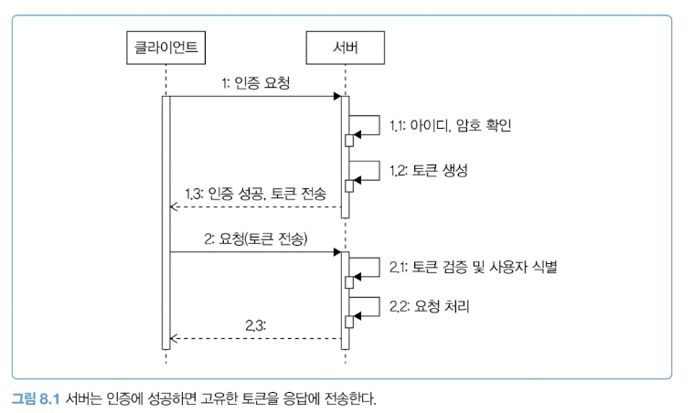

로그인에 성공하면 서버는 문자열 토큰을 발급한다. 이후 클라이언트는 매 요청에 토큰을 실어 보내고, 서버는 아이디·암호를 다시 받지 않고 **토큰으로 사용자를 식별**한다.

토큰과 사용자를 연결하려면 매핑 정보를 어딘가 저장해야 한다. 위치는 크게 2가지다.

| 방식 | 매핑 정보 위치 |
| --- | --- |
| 별도 저장소 | DB, 레디스 |
| 토큰 자체 | 토큰 안에 사용자 식별자를 담음 (JWT) |

### ① 별도 저장소에 저장하기

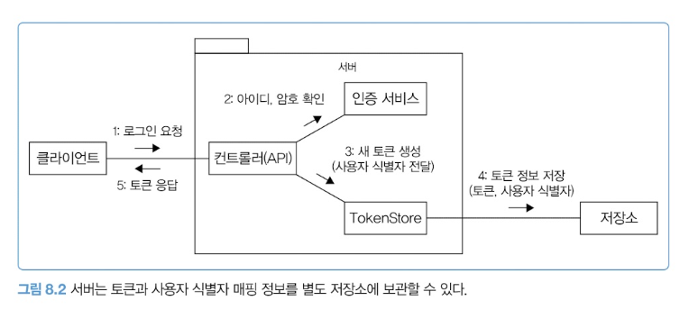

로그인 성공 시 임의의 토큰 문자열을 만들고 외부 저장소에 매핑을 보관한다. **토큰 문자열은 고유해야** 사용자 정보가 잘못 매칭되지 않는다.

저장 데이터: 토큰, 사용자 식별자, 생성 시간, 최근 사용 시간, 그 외 유효 시간·클라이언트 버전 등

```java
String token = ... // 클라이언트가 전송한 토큰
Optional<TokenData> tokenDataOpt = tokenStore.getTokenData(token);
TokenData tokenData = tokenDataOpt.orElseThrow(() -> new InvalidTokenException());
```

**용량 걱정은 거의 없다.** G 서비스는 340만 개 토큰에 테이블 크기가 2.4G 수준. 레디스로도 충분하다. 100배로 커져 3억 4천만 개(240G)가 되면 그때 DB 같은 저장소로 옮긴다.

**Memo**: 토큰이 3억 개 이상 생겼다면 서비스가 잘 된다는 뜻이니 저장소 비용이 아깝지 않을 것이다.

### ② 서버 메모리에 저장하기 — 서블릿 세션

톰캣 같은 서블릿 컨테이너는 메모리에 세션 객체를 저장한다. **이때 세션 ID가 토큰에 해당한다.**

```java
HttpSession session = request.getSession(false); // 세션을 구한다
if (session == null) {
    throw new AuthenticationException();
}
UserSessionData data = (UserSessionData) session.getAttribute("userSessionData");
if (data == null) {
    throw new AuthenticationException();
}
```

> `getSession(false)`가 핵심. `getSession()` 또는 `getSession(true)`는 **없으면 새로 만들어버려서** 인증 검사가 무의미해진다.
> null 체크가 두 번인 이유: ① 세션 자체가 없음(미접속) ② 세션은 있는데 로그인 데이터가 없음(비로그인).

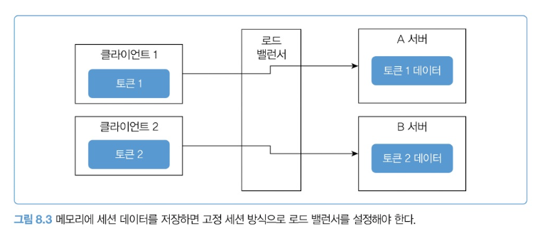

**메모리 방식은 고정 세션(sticky session)이 필요하다.** 서버마다 다른 토큰 집합을 갖기 때문이다. 클라이언트 1의 토큰이 A 서버에 있는데 요청이 B로 가면 처리할 수 없다.

| 단점 1 | 서버를 재시작하면 토큰 데이터가 사라짐 (배포할 때마다 전원 로그아웃) |
| --- | --- |
| 단점 2 | 생성 가능한 세션 개수가 메모리 크기에 제한됨 |

**해결 — 스프링 세션**: 메모리 대신 DB나 레디스에 세션 데이터를 저장한다. 외부 저장소를 쓰면서도 **`HttpSession`을 그대로 사용할 수 있다는 것**이 장점이다. 코드는 위와 동일하고 구현체만 갈아끼운다.

**Column — 스티키 세션의 진짜 비용**
책은 짧게 넘어가지만 실무에서 아프다. ① A 서버가 죽으면 A에 붙어있던 사용자 전원 로그아웃 ② 무거운 사용자가 몰려도 다른 서버로 못 넘김 ③ 배포 = 전원 로그아웃 ④ 서버를 늘려도 기존 사용자는 원래 서버에만 붙어 스케일 아웃이 반쪽이 된다.

### ③ 토큰 자체에 저장하기 — JWT

```java
String token = Jwts.builder()
        .subject("userid") // 사용자 식별자
        .signWith(key)
        .compact();
return LoginResponse.of(token);
```

```java
try {
    Jws<Claims> jwt = Jwts.parser().verifyWith(key).build().parseSignedClaims(jws);
    String userId = jwt.getPayload().getSubject();
} catch (JwtException e) {
    throw new AuthenticationException(e);
}
```

| 장점 | 토큰만 있으면 사용자를 확인 가능. 외부 DB 불필요 → 서버 구조가 단순하고 **수평 확장이 쉽다** |
| --- | --- |
| 단점 1 | 토큰 안에 데이터가 들어가 **네트워크 트래픽 증가** → 최소한의 데이터만 넣을 것 |
| 단점 2 | **서버에서 토큰 데이터를 제어할 수 없다** → 삭제·변경 불가 |

> 저장소 방식은 데이터를 지우면 즉시 무효화된다. JWT는 이미 나간 토큰을 회수할 방법이 없다.
> 그래서 JWT는 **유효 시간 설정이 사실상 필수**다.

### 세 방식 비교

|  | 서버 메모리 (HttpSession) | 외부 저장소 (스프링 세션) | 토큰 자체 (JWT) |
| --- | --- | --- | --- |
| 데이터 위치 | 톰캣 힙 | 레디스, DB | 토큰 안 |
| 스티키 세션 | **필요** | 불필요 | 불필요 |
| 재시작 시 | **소실** | 유지 | 무관 |
| 강제 로그아웃 | 쉬움 | 쉬움 | **어려움** |
| 수평 확장 | 어려움 | 쉬움 | **가장 쉬움** |

### 토큰 송수신

| 쿠키 | 쿠키를 사용해서 토큰 전송 |
| --- | --- |
| 헤더 | 특정 이름(Token, X-token, Auth, Authorization)을 갖는 헤더로 전송 |

**Memo**: 정확히는 URL 뒤에 토큰을 붙이는 방식도 있지만 거의 사용되지 않는다.

- **웹 사이트는 주로 쿠키.** 브라우저가 모든 요청에 자동으로 실어 보내므로 별도의 자바스크립트 코드가 필요 없다. 서버 세션도 쿠키로 세션 ID를 주고받는다.
- **앱은 주로 헤더.** 클라이언트가 토큰을 로컬에 저장했다가 요청 시 헤더에 넣는다.

**Column — 왜 웹은 쿠키고 앱은 헤더인가**

차이는 하나다. **쿠키는 브라우저가 자동으로 붙이고, 헤더는 코드가 직접 붙인다.** 여기서 방어할 수 있는 공격이 갈린다.

|  | XSS (나쁜 스크립트가 심어짐) | CSRF (남의 사이트에서 내 이름으로 요청) |
| --- | --- | --- |
| 쿠키 | `HttpOnly`로 방어 ✅ | **취약** ❌ (`SameSite` 필요) |
| 헤더 | **취약** ❌ (localStorage는 JS가 읽음) | 자동으로 안 붙어 안전 ✅ |

앱에는 웹페이지가 없어 **XSS가 애초에 일어나지 않는다.** 쿠키의 최대 장점(`HttpOnly`)이 필요 없어지는 것이다. 게다가 앱에는 키체인·Keystore 같은 전용 금고가 있다. 그래서 앱은 헤더다.

### 토큰 보안

서버 보안을 철저히 해도 **클라이언트가 취약하면 토큰이 탈취**될 수 있다. 토큰을 탈취한 클라이언트는 원래 소유자처럼 행세할 수 있다.

**완화책 1 — 유효 시간 제한**

| 방식 | 기준 | 예시 |
| --- | --- | --- |
| 절대 만료 | **생성 시점** | 9시에 1시간짜리 발급 → 10시 만료 (고정) |
| 갱신 만료 | **마지막 접근 시점** | 유효 10분, 11시 접근 → 11:10 만료. 11:05 재접근 → 11:15로 갱신 |

> **서블릿 세션이 두 번째 방식이다.** 요청할 때마다 타이머가 리셋되므로 계속 쓰면 안 끊기고, 안 쓸 때만 정리된다.
> JWT는 만료 시각이 토큰 안에 박혀 있어 **절대 만료만 가능**하다.

유효 시간은 서비스 성격에 맞춘다.

| 일반 서비스 | 너무 짧으면 불편 (10분이면 조금만 안 써도 로그인 풀림) |
| --- | --- |
| 관리자 사이트 | 길게 잡으면 안 됨 — 자리 비운 사이 민감 정보가 조회될 수 있음 |

**완화책 2 — 클라이언트 IP 비교**

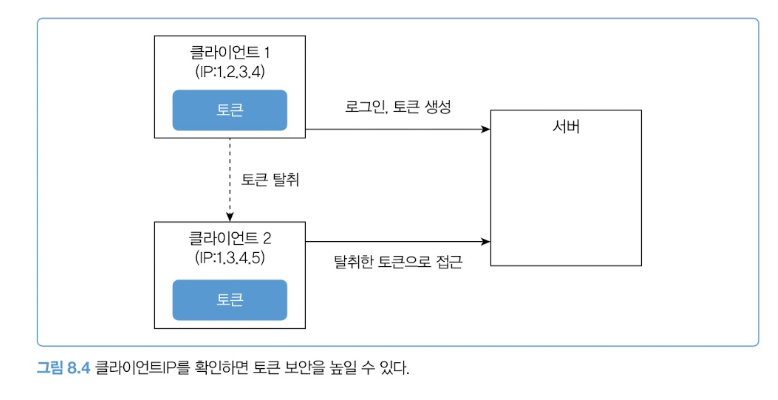

토큰 생성 시 접근한 IP와 실제 전송한 IP가 다르면 비정상 접근으로 간주하고 거부한다.

**완화책 3 — 토큰 무효화(강제 로그아웃)**

외부 저장소 방식이면 데이터를 삭제하거나 무효 상태로 바꾸면 끝이다. **토큰 자체에 데이터를 담는 방식은 추가 개발이 필요하다.** 예를 들어 사용자마다 유효한 토큰 생성 시간 제한을 두고, 이 시간 이전에 생성된 토큰은 유효하지 않다고 판단한다.

**알아두기 — 토큰 재발급**

| 액세스 토큰 | 인증된 사용자임을 확인하는 용도. 만료가 **짧다** (몇 분~몇 시간) |
| --- | --- |
| 리프레시 토큰 | 액세스 토큰을 재발급받는 용도. 만료가 **길다** |

로그인 성공 시 둘 다 발급하고, 액세스 토큰이 만료되면 리프레시 토큰으로 새로 발급받는다. 사용자는 리프레시 토큰이 만료될 때까지 재로그인 없이 인증 상태를 유지한다.

**Column — JWT 무효화를 어떻게 구현하나**

책의 "유효한 토큰 생성 시간 제한"을 구체화하면 이렇다. `users` 테이블에 `valid_after` 컬럼 하나를 두고, 검증할 때 토큰의 발급 시각(`iat`)과 비교한다.

```java
if (토큰의_발급시각 < user.valid_after) { 거부; }
```

비밀번호 변경·해킹 의심 시 `valid_after`를 현재 시각으로 UPDATE하면 **그 사용자의 모든 기존 토큰이 한 번에 죽는다.**

|  | 블랙리스트 | valid_after |
| --- | --- | --- |
| 저장량 | 무효화된 토큰 전부, 계속 증가 | **사용자당 1행, 고정** |
| 정리 작업 | 배치 필요 | 불필요 |
| 전체 로그아웃 | 발급 토큰을 전부 추적해야 함 | **UPDATE 한 방** |
| 특정 기기만 끊기 | **가능** | 불가 |

실무에서는 대량 무효화는 `valid_after`, 개별 기기 로그아웃만 블랙리스트로 섞어 쓴다.

### 인가와 접근 제어 모델

> 인증과 토큰이 "누구인지"를 확인한다면, 인가는 **"요청한 기능을 실행할 권한이 있는지"** 를 확인한다.
> 8.1의 K사 사고는 로그인 여부만 확인하고 권한 검사를 하지 않아 생긴 사고였다.

**접근 제어의 기본은 접근한 사용자를 토큰이나 세션으로 식별하는 것이다.**

```java
@GetMapping("/myinfo")
public ResponseEntity<?> getMyInfo(@RequestHeader("token") String token) {
    String userId = getUserIdByToken(token); // 토큰으로 사용자 식별값 구함
    MyInfoResponse info = myInfoService.getMyInfo(userId);
    return ResponseEntity.ok(info);
}
```

> **API 요청 파라미터로 로그인한 사용자의 식별자를 받으면 안 된다.**
> K사와 H서비스는 정확히 이걸 해서 사고가 났다.

**RBAC (역할 기반 접근 제어)**

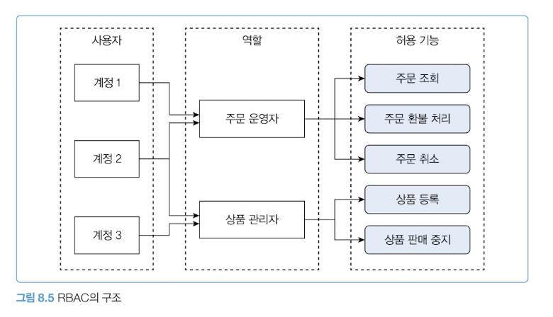

역할별로 실행 가능한 기능 집합을 할당하고, 사용자에게는 역할을 부여한다.

| 계정 | 역할 | 실행 가능 기능 |
| --- | --- | --- |
| 계정 1 | 주문 운영자 | 주문 조회, 환불 처리, 주문 취소 |
| 계정 2 | 주문 운영자 + 상품 관리자 | 위 3개 + 상품 등록, 상품 판매 중지 (5개) |
| 계정 3 | 상품 관리자 | 상품 등록, 상품 판매 중지 |

**사용자별 권한 부여**

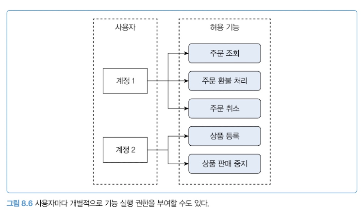

역할을 두지 않고 사용자마다 개별적으로 권한을 부여할 수도 있다.

|  | 역할별 | 사용자별 |
| --- | --- | --- |
| 장점 | 체계적 관리, 신입에게 역할만 부여하면 끝 | 구현이 단순 |
| 단점 | **역할이 무분별하게 늘어남** | 규모가 커지면 관리 불가 |
| 적합 | 규모 있는 시스템 | 소규모, 역할 나누기 애매할 때 |

> 필자 경험상 역할을 꾸준히 관리하지 않으면 **비슷한 역할이 반복 생성되고 안 쓰는 역할도 남아** 관리가 복잡해진다.
> 두 방식은 단독보다 **함께 쓰는 경우가 많다.**

**ABAC (속성 기반 접근 제어)**

사용자의 속성을 이용해 접근을 제어한다. 예를 들어 IP 주소에 따라 특정 기능의 접근을 허용하거나 제한한다.

| 장점 | 보다 정교한 접근 제어 |
| --- | --- |
| 단점 | 구현이 복잡, **속성과 규칙 정의에 많은 시간** 소요 |

**Column — RBAC로 표현이 안 되는 조건들**

역할만으로 판단이 안 되는 요구가 ABAC을 부른다.

- "매니저는 **자기 부서** 문서만" / "**업무 시간**에만" / "**사내망**에서만" / "작성자 본인은 **자기 글**만"

이걸 역할로 풀려고 하면 `MANAGER_SALES`, `MANAGER_HR`, `MANAGER_SALES_READONLY`... 로 쪼개지는 **역할 폭발**이 일어난다. ABAC은 주체·자원·행위·환경 속성을 조합해 규칙으로 판단한다.

```
IF 주체.부서 == 자원.부서 AND 환경.시각 IN 업무시간 AND 환경.IP IN 사내망 THEN 허용
```

실무에서는 큰 틀은 역할, 세부는 속성으로 섞는다. `@PreAuthorize("hasRole('MANAGER') and #doc.dept == authentication.dept")`

**Memo**: 시스템의 요구 수준에 따라 단순 로그인 여부 확인부터 RBAC, ABAC, 사용자별 권한을 조합하기도 한다. 접근 제어가 정교해질수록 복잡해지므로 **실제로 필요한 수준까지만** 설계하자.

**Column — 운영 계정 공유하지 않기**
직원이 적을 때 관리자 계정을 여러 명이 공유하기도 하는데 매우 위험하다. 고객에게 현금성 포인트를 지급하는 기능이 있다고 하자. 모든 운영자가 같은 계정을 쓰면 **누가 지급했는지 식별할 수 없다.** 악의적으로 지인에게 무단 지급해도 책임 소재를 파악할 수 없다. 최소한 운영자마다 별도 계정을 발급해 추적 가능해야 한다.

---

## 8.3 데이터 암호화 (p.225-235)

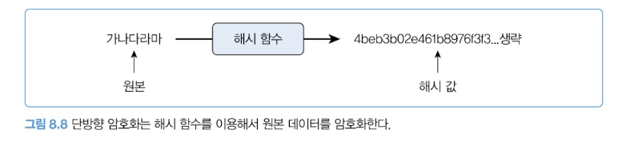

유출되면 가장 큰 피해로 이어지는 데이터가 로그인 아이디와 비밀번호다. 많은 사용자가 여러 서비스에서 **동일한 비밀번호를 쓰는 경향**이 있어, 한 서비스가 뚫리면 다른 서비스까지 위험해진다.

> 위협은 외부만이 아니다. **DB에 접근 가능한 엔지니어가 회원 테이블에서 비밀번호를 볼 수 있다면** 그 자체로 보안 위협이다. 대부분은 악용하지 않지만 사람을 100% 신뢰할 수는 없고, 엔지니어 PC가 해킹당할 수도 있다.

암호화해두면 유출되더라도 원래 값을 알아내기 어렵고, 알아내더라도 시간이 걸린다. **그 시간 동안 비밀번호를 변경하는 등 사후 대응이 가능하다.**

|  | 단방향 | 양방향 |
| --- | --- | --- |
| 복호화 | **불가** | 가능 |
| 판단 기준 | 되돌릴 필요가 없는가 | 다시 봐야 하는가 |
| 예 | 로그인 비밀번호 | 주민번호, 계좌번호, 통신 구간 |

### 단방향 암호화

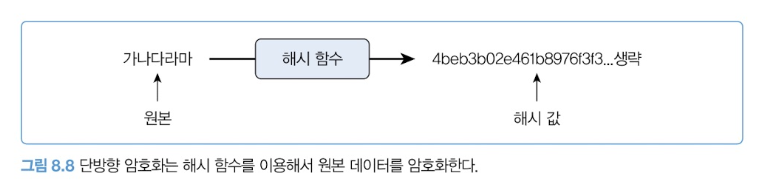

해시 함수로 데이터를 해시 값으로 변환한다. 알고리즘에는 SHA-256, MD5, BCrypt 등이 있다.

**원본이 조금만 달라도 완전히 다른 해시 값**이 나온다. '가나다라' → `df2ef824...`, '가나다마' → `fa262235...`

```java
byte[] origin = input.getBytes("UTF-8");
MessageDigest digest = MessageDigest.getInstance("SHA-256");
byte[] hash = digest.digest(origin); // byte 배열을 암호화
```

입력과 리턴이 모두 **바이트 배열**이므로, 문자열은 캐릭터셋을 지정해 변환한다. 결과를 DB에 저장하려면 16진수나 Base64로 문자열화한다.

```java
public static String encrypt(String input) {
    StringBuilder hexString = new StringBuilder();
    try {
        MessageDigest digest = MessageDigest.getInstance("SHA-256");
        byte[] hash = digest.digest(input.getBytes("UTF-8"));
        for (byte b : hash) {
            String hex = Integer.toHexString(0xff & b);
            if (hex.length() == 1) hexString.append('0');
            hexString.append(hex);
        }
    } catch (Exception e) {
        throw new RuntimeException(e);
    }
    return hexString.toString();
}
```

**알아두기 — 충돌 저항성**
해시 함수는 원본 길이에 상관없이 **일정한 길이**의 해시 값을 만든다. 길이가 제한되므로 서로 다른 데이터가 동일한 해시 값을 가질 수 있다. 동일한 해시 값을 갖는 서로 다른 데이터를 **찾기 어려울 때** 충돌 저항성을 갖는다고 한다.
생성 결과가 길수록 충돌 가능성이 줄어든다. SHA-256(32바이트) 대비 SHA-512(64바이트)가 충돌 가능성이 더 낮다.

> 무한개의 입력을 유한개의 출력에 밀어넣으므로 **충돌은 반드시 존재한다.** 관건은 "없다"가 아니라 "못 찾는다"이다. MD5는 2004년, SHA-1은 2017년에 충돌 쌍을 만드는 방법이 나왔으므로 **보안 용도로 쓰면 안 된다.**

### 값의 비교

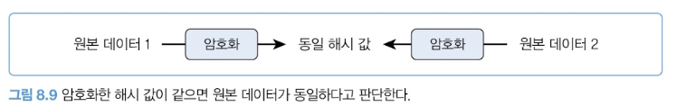

```java
String inputPwdHash = encodePassword(inputPwd);  // 입력한 비밀번호를 암호화
String dbPwdHash = selectDbPwd(userId);          // DB에 저장된 해시 값 조회
if (inputPwdHash.equals(dbPwdHash)) {
    // 두 값이 같으면 비밀번호를 올바르게 입력함
}
```

> **해시를 되돌리는 게 아니라, 똑같이 해시해서 결과끼리 비교한다.** 단방향인데도 검증이 되는 이유다.

복호화할 수 없으므로 **기존 비밀번호를 알려주는 기능은 구현할 수 없다.** 대신 임의의 문자열로 초기화하고, 등록된 이메일이나 문자로 전달한다.

### Salt로 보안 강화하기

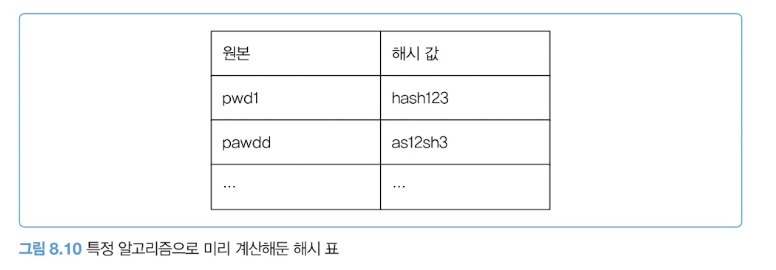

같은 알고리즘을 쓰면 동일한 원본에 대해 **항상 동일한 해시 값**이 생성된다. 해커가 문자열과 해시 값을 미리 계산해둔 표를 갖고 있다면? 이런 표를 **레인보우 테이블**이라고 한다.

탈취한 해시 값이 `hash123`이면 표를 참고해 원본이 `pwd1`임을 알 수 있고, 이를 이용해 로그인을 시도한다.

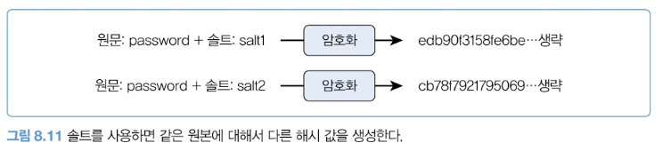

**솔트는 임의의 값이며, 암호화할 때 함께 사용하면 솔트 값에 따라 결과 해시 값이 달라진다.**

```java
public static String encryptWithSalt(String input, String salt) {
    StringBuilder hexString = new StringBuilder();
    try {
        MessageDigest digest = MessageDigest.getInstance("SHA-256");
        digest.update(salt.getBytes());  // salt 추가
        byte[] hash = digest.digest(input.getBytes("UTF-8"));
        for (byte b : hash) {
            String hex = Integer.toHexString(0xff & b);
            if (hex.length() == 1) hexString.append('0');
            hexString.append(hex);
        }
    } catch (Exception e) {
        throw new RuntimeException(e);
    }
    return hexString.toString();
}
```

동일한 솔트와 동일한 알고리즘으로 표를 만들지 않는 한 원본을 추측하기 어렵다. **사용자마다 서로 다른 솔트**를 쓰면 보안 강도가 더 올라간다.

**Column — 솔트는 숨기는 게 아니다**

`MessageDigest`는 솔트라는 개념을 모른다. `update()`는 그냥 데이터를 이어붙이는 메서드일 뿐이고, **솔트 생성·저장·관리는 전부 직접 해야 한다.**

솔트를 만들 때 두 가지를 지켜야 한다.

| ✅ | `new SecureRandom().nextBytes(salt)` — 랜덤, 사용자마다 다름 |
| --- | --- |
| ❌ | 이메일·가입일 등 사용자 정보 — 예측 가능해서 미리 표를 만들 수 있고, 값이 바뀌면 전원 로그인 불가 |

그리고 **솔트는 DB에 평문으로 저장한다.** 목적이 비밀 유지가 아니라 "같은 비번 → 다른 해시"를 만드는 것이기 때문이다. 공격자가 솔트를 알아도, 사용자 100만 명이면 표를 100만 번 새로 만들어야 한다.

**Column — SHA-256으로 비밀번호를 저장하면 안 되는 이유**

솔트는 **미리 만든 표**를 막을 뿐, 공격자가 그 자리에서 직접 계산하는 것은 못 막는다. 그리고 SHA-256은 **너무 빠르다.**

|  | 초당 시도 | 8자리 영숫자(2,000억 조합) 소요 |
| --- | --- | --- |
| SHA-256 (GPU) | 약 100억 | **20초** |
| bcrypt (cost 10) | 약 10 | **600년** |

bcrypt·Argon2는 같은 계산을 수천~수만 번 반복해 **일부러 느리게** 만든 해시다. 정상 사용자는 로그인당 0.1초라 무시할 수준이지만, 수십억 번 돌려야 하는 공격자에겐 치명적이다.

```java
PasswordEncoder encoder = new BCryptPasswordEncoder();
String hash = encoder.encode("password123");            // 저장
boolean ok = encoder.matches("password123", hash);      // 검증
```

bcrypt는 랜덤 솔트를 알아서 만들고 결과 문자열 안에 함께 넣는다.

```
$2a$10$N9qo8uLOickgx2ZMRZoMye7VoBLCG.Y0dtGhbdBOxDDVfHqxYzn7C
 └┬┘ └┬┘ └──── 솔트 22자 ────┘└─────── 해시 31자 ───────┘
  │   └ 반복 횟수 (2^10)
  └ 버전
```

**salt 컬럼을 따로 만들 필요가 없다.** 다만 같은 비번을 두 번 인코딩하면 결과가 매번 다르므로 `equals`가 아니라 반드시 `matches()`로 비교해야 한다.

### 양방향 암호화

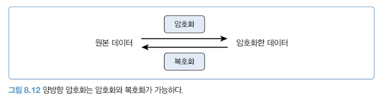

암호화와 복호화가 모두 가능한 방식. SSH, HTTPS처럼 **보안이 중요한 데이터 송수신**에 주로 쓰인다. 대표 알고리즘은 AES와 RSA.

> 같은 알고리즘, 같은 원본이라도 **어떤 키를 쓰느냐에 따라 결과가 달라진다.**

**대칭 키**

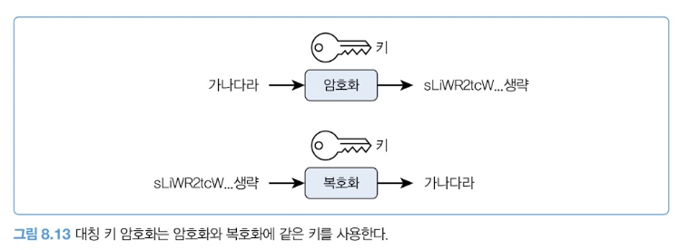

암호화와 복호화에 **동일한 키**를 사용한다. 즉 양쪽이 같은 키를 공유해야 한다. 키가 유출되면 누구나 복호화할 수 있으므로 키 보안이 매우 중요하다.

**비대칭 키**

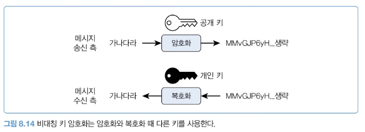

공개 키와 개인 키를 생성한다. 공개 키는 누구에게나 공개할 수 있고, 개인 키는 소유자만 접근할 수 있어야 한다.

| 방향 | 잠금 | 열기 | 잠글 수 있는 사람 | 목적 |
| --- | --- | --- | --- | --- |
| ① | 공개 키 | 개인 키 | **누구나** | 비밀 유지 |
| ② | 개인 키 | 공개 키 | **주인만** | 신원 증명·서명 |

> 방향 ②는 내용이 비밀이 아니다. 누구나 열 수 있으니까. 하지만 **"이걸 잠글 수 있는 건 개인 키 주인뿐"** 이 증명된다. 도장을 찍는 것과 같다.
> 공개 키가 유출되더라도 암호화한 데이터를 복호화할 수 없으므로, 키를 공유해야 하는 대칭 방식보다 안전하다.

**알아두기 — SSH의 키 쌍을 이용한 사용자 인증 과정**

1. 클라이언트는 인증에 사용할 키 쌍의 ID를 서버에 전송한다.
2. 서버는 키 ID에 해당하는 공개 키를 `authorized_keys` 파일에서 찾는다.
3. 공개 키가 존재하면 임의의 숫자를 생성해서 공개 키로 암호화한다.
4. 암호화한 숫자를 클라이언트에 전송한다.
5. 클라이언트는 개인 키로 암호화된 숫자를 복호화한다.
6. 클라이언트는 복호화한 숫자와 공유 세션 키를 결합한 값의 해시를 구한다.
7. 클라이언트는 해시 값을 서버에 전송한다.
8. 서버는 클라이언트가 전송한 해시 값과 서버가 임의 숫자와 공유 세션 키로 생성한 해시 값이 같은지 비교한다.
9. 두 값이 일치하면 클라이언트를 인증한다.

> 3~5번이 **시험 문제**다. "개인 키가 있어야만 풀 수 있는 문제를 풀었으니 본인이 맞다"는 논리(챌린지-리스폰스).
> 6~7번에서 숫자를 그대로 안 보내고 해시로 보내는 이유는 **가로채서 재사용하는 것을 막기 위해서**다. 세션 키를 섞으므로 이번 접속에서만 유효하다.
> 핵심은 **개인 키가 네트워크로 나가지 않는다**는 것. 서버가 털려도 `authorized_keys`에는 공개 키뿐이다.

### AES 대칭 키 암호화 예

AES를 쓸 때는 두 값을 생성해서 공유한다.

- **키(Key)** — 128/192/256비트 중 하나 (16/24/32바이트)
- **IV(Initialization Vector, 초기화 벡터)** — 길이 16인 바이트 배열

```java
public static byte[] generateSecretKey() throws Exception {
    KeyGenerator keyGenerator = KeyGenerator.getInstance("AES");
    keyGenerator.init(256); // 256비트 키 생성
    SecretKey secretKey = keyGenerator.generateKey();
    return secretKey.getEncoded(); // 길이 32 바이트의 배열 반환
}
```

보관된 키로 다시 `SecretKey` 객체를 만들 때:

```java
SecretKey key = new SecretKeySpec(bytes, "AES");
```

**왜 IV가 필요한가** — 같은 키로 같은 데이터를 암호화하면 **항상 같은 결과**가 나온다. 반복되는 패턴은 공격자에게 단서를 준다. IV를 함께 쓰면 같은 키를 써도 결과값이 매번 달라진다.

```java
public static byte[] genIv() {
    byte[] iv = new byte[16];
    new SecureRandom().nextBytes(iv);
    return iv;
}
```

```java
public static String encrypt(String plain, SecretKey key, byte[] iv) throws Exception {
    Cipher cipher = Cipher.getInstance("AES/CBC/PKCS5Padding"); // 알고리즘
    IvParameterSpec parameterSpec = new IvParameterSpec(iv);
    cipher.init(Cipher.ENCRYPT_MODE, key, parameterSpec);
    byte[] encrypted = cipher.doFinal(plain.getBytes("UTF-8")); // 암호화 실행
    return Base64.getEncoder().encodeToString(encrypted);
}

public static String decrypt(String encrypted, SecretKey key, byte[] iv) throws Exception {
    Cipher cipher = Cipher.getInstance("AES/CBC/PKCS5Padding");
    IvParameterSpec parameterSpec = new IvParameterSpec(iv);
    cipher.init(Cipher.DECRYPT_MODE, key, parameterSpec);
    byte[] decoded = Base64.getDecoder().decode(encrypted);
    byte[] decrypted = cipher.doFinal(decoded); // 복호화 실행
    return new String(decrypted, "UTF-8");
}
```

**`"AES/CBC/PKCS5Padding"`의 세 부분**

| AES | 암호화 알고리즘 |
| --- | --- |
| CBC | 암호화 모드 — 앞 블록 결과를 다음 블록에 섞어 패턴을 감춘다 |
| PKCS5Padding | 패딩 방식 — 16바이트 블록에 길이가 안 맞는 마지막 블록을 규칙대로 채운다 |

모드에 따라 패딩이 필요 없기도 하다. **GCM 모드는 `NoPadding`을 사용한다.**

**Column — 키는 고정, IV는 매번 랜덤**

|  | 매번 바뀜? | 비밀? | 저장 위치 |
| --- | --- | --- | --- |
| **키** | ❌ 고정 | 🔒 **비밀** | KMS, Vault, 환경변수 |
| **IV** | ✅ **매번 랜덤** | 공개 OK | 암호문 앞에 붙여 DB에 |

키를 바꾸면 예전에 암호화한 데이터를 못 푼다. 그래서 키는 만들어서 계속 쓰고, **대신 IV가 매번 달라져 패턴 문제를 해결한다.**

책은 "IV도 안전하게 저장해야 한다"고 쓰지만, 이는 *조작되지 않게 관리하라*는 뜻이지 *비밀로 하라*는 뜻이 아니다. **IV를 알아도 키가 없으면 아무것도 못 한다.** 표준 저장 형태는 `[IV 16바이트][암호문]`이다.

> 앞의 **솔트와 IV는 같은 역할**이다. 둘 다 비밀이 아니라 "같은 입력 → 같은 출력"을 깨뜨리는 **구별자**다.

### 비대칭 키 암호화 예

```java
KeyPairGenerator keyGen = KeyPairGenerator.getInstance("RSA");
keyGen.initialize(2048); // 키 길이 2048비트로 설정
KeyPair keyPair = keyGen.generateKeyPair();
PublicKey publicKey = keyPair.getPublic();     // 공개 키
PrivateKey privateKey = keyPair.getPrivate();  // 개인 키
byte[] publicKeyBytes = publicKey.getEncoded();
byte[] privateKeyBytes = privateKey.getEncoded();
```

저장한 바이트 배열을 다시 키 객체로 변환할 때:

```java
public static KeyPair getKeyPairFromBytes(byte[] publicKeyBytes, byte[] privateKeyBytes)
        throws NoSuchAlgorithmException, InvalidKeySpecException {
    KeyFactory keyFactory = KeyFactory.getInstance("RSA");
    PublicKey publicKey = keyFactory.generatePublic(new X509EncodedKeySpec(publicKeyBytes));
    PrivateKey privateKey = keyFactory.generatePrivate(new PKCS8EncodedKeySpec(privateKeyBytes));
    return new KeyPair(publicKey, privateKey);
}
```

> `X509`, `PKCS8`은 **저장 형식 이름**일 뿐이다. 공개 키와 개인 키는 담긴 정보가 달라 형식도 다르다. 공개=X509, 개인=PKCS8로 짝만 기억하면 된다.

```java
public static String encrypt(String plain, PublicKey publicKey) {
    Cipher cipher = Cipher.getInstance("RSA");
    cipher.init(Cipher.ENCRYPT_MODE, publicKey);
    byte[] encryptedBytes = cipher.doFinal(plain.getBytes("UTF-8"));
    return Base64.getEncoder().encodeToString(encryptedBytes);
}

public static String decrypt(String encrypted, PrivateKey privateKey) {
    Cipher cipher = Cipher.getInstance("RSA");
    cipher.init(Cipher.DECRYPT_MODE, privateKey);
    byte[] decodedBytes = Base64.getDecoder().decode(encrypted);
    byte[] decryptedBytes = cipher.doFinal(decodedBytes);
    return new String(decryptedBytes, "UTF-8");
}
```

**AES와 나란히 놓고 보면**

|  | AES (대칭) | RSA (비대칭) |
| --- | --- | --- |
| 키 | **1개** | **2개 (쌍)** |
| 암호화 | 그 키 | 공개 키 |
| 복호화 | **같은 키** | **개인 키** |
| IV | **필요** | 없음 (패딩이 대신 랜덤 처리) |
| 속도 | ~1 GB/s | ~1,000회/s |
| 한 번에 처리 | 무제한 | **245바이트** |
| 문제점 | **키를 어떻게 전달?** | 느리고 짧음 |

**Column — 실무에서는 둘을 섞는다 (하이브리드)**

RSA-2048은 한 번에 245바이트까지만 암호화할 수 있고 AES보다 수천 배 느리다. **RSA로 대용량 데이터를 암호화하는 일은 실무에 없다.**

```
1. AES 키를 랜덤으로 만든다 (32바이트 — RSA로 충분히 감당)
2. 그 AES 키를 RSA 공개 키로 암호화해서 보낸다
3. 실제 데이터는 AES로 암호화해서 보낸다
4. 받는 쪽: 개인 키로 AES 키를 풀고 → 그걸로 데이터를 푼다
```

| RSA | 키 전달, 서명 (짧고 중요한 것) |
| --- | --- |
| AES | 실제 데이터 (길고 많은 것) |

HTTPS, SSH, PGP가 전부 이 구조다. 앞의 SSH 인증 절차 6번에 나오는 "공유 세션 키"가 바로 이렇게 합의한 대칭 키다.

**Column — 실무 권장 설정**

| 항목 | 책의 예제 | 권장 |
| --- | --- | --- |
| 비밀번호 해시 | SHA-256 + 솔트 | **bcrypt / Argon2** |
| AES 모드 | CBC | **GCM** (위변조 감지 포함) |
| RSA 패딩 | 기본(PKCS1) | **OAEP** |
| 키 보관 | — | 환경변수, AWS KMS, Vault (**소스에 하드코딩 금지**) |

CBC는 위변조를 감지하지 못한다. 공격자가 암호문을 조작해도 서버가 모르고 복호화한다. GCM은 인증 태그가 붙어 조작되면 예외가 발생한다.

---

## 8.4 HMAC을 이용한 데이터 검증 (p.236-238)

API 통신에서 클라이언트가 만든 데이터를 서버가 그대로 믿으면 안 된다. 게임 결과에 따라 포인트를 지급한다고 하자.

```json
{
    "result": "A",
    "bonus": 10
}
```

> 중간에 누군가 데이터를 위변조해서 보내면 **실제보다 많은 포인트를 지급**해야 한다.

**HMAC**(Hash-based Message Authentication Code)은 해시 함수와 비밀 키로 다음 2가지를 보장한다.

| 메시지 무결성 | 메시지가 중간에 위변조되지 않았음 |
| --- | --- |
| 인증 | 메시지 발신자를 인증할 수 있음 (발신자만 비밀 키 접근) |

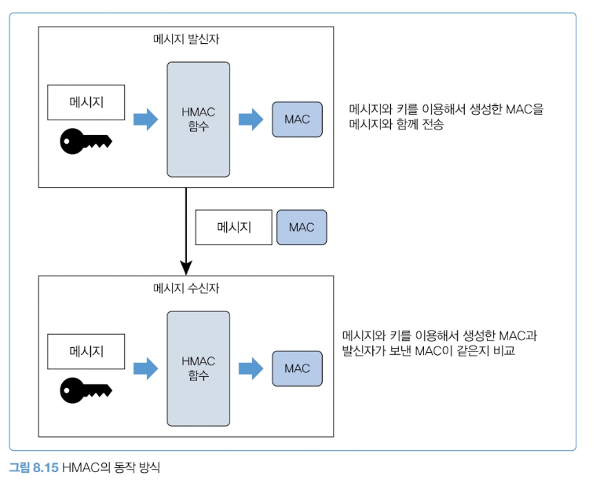

발신자와 수신자는 **둘만 아는 비밀 키**를 공유한다. 이 키는 외부에 노출되면 안 된다.

```
발신자: 메시지 + 비밀 키 → HMAC → MAC 생성 → 메시지와 MAC을 함께 전송
수신자: 받은 메시지 + 비밀 키 → HMAC → MAC 재생성 → 받은 MAC과 비교
       같으면 변경되지 않음 / 다르면 유효하지 않은 메시지
```

```java
public static class HMAC {
    private String secretKey;
    public HMAC(String secretKey) {
        this.secretKey = secretKey;
    }
    public String hmac(String message) {
        try {
            Mac mac = Mac.getInstance("HmacSHA256");
            SecretKeySpec secretKeySpec =
                    new SecretKeySpec(secretKey.getBytes(), "HmacSHA256");
            mac.init(secretKeySpec);
            byte[] hash = mac.doFinal(message.getBytes("UTF-8"));
            return Base64.getEncoder().encodeToString(hash);
        } catch (Exception e) {
            throw new RuntimeException(e);
        }
    }
}
```

| 장점 | 단순함과 효율성. 비밀 키만 공유하면 낮은 비용으로 인증 보안 구현 |
| --- | --- |
| 단점 | **비밀 키 관리.** 유출되면 취약해지고, 키 교체도 까다롭다 |

---

## 8.5 방화벽으로 필요한 트래픽만 허용하기 (p.239-240)

> 서버가 외부에 노출되기 시작하면 **포트 스캔부터 다양한 공격이 들어온다.**
> 필요한 만큼만 허용하고 나머지는 차단해야 한다.

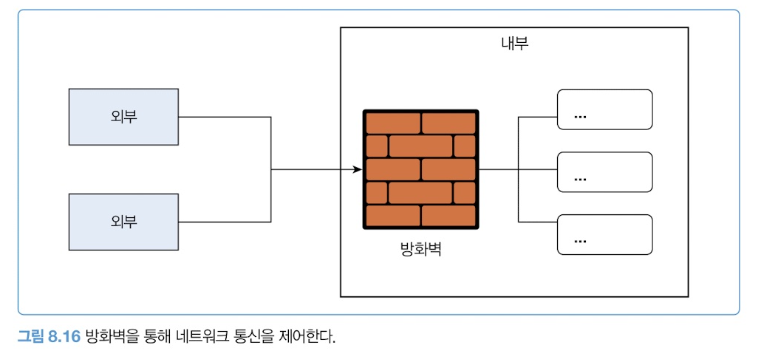

방화벽은 물리 장비로 존재하기도 하고 가상 방화벽(예: AWS 보안 그룹)으로 존재하기도 한다.

| 인바운드 | 외부에서 내부로 유입 |
| --- | --- |
| 아웃바운드 | 내부에서 외부로 유출 |

**인바운드 — 필수만 허용**

모든 외부 IP의 모든 포트를 여는 대신, 특정 서버 IP의 443 포트만 허용하는 식으로 노출을 최소화한다. 접속을 허용할 클라이언트 IP도 최소 범위로 지정한다.

- 서비스 API: 외부의 모든 IP에서 서버A IP에 443 포트로 접근 가능
- 관리자 API: **사내 IP만** 서버B IP의 443 포트로 접근 가능

**아웃바운드 — 이것도 제한한다**

> 아웃바운드를 모두 허용하면 서버가 해킹당했을 때 **해커의 중간 경유지로 악용**될 수 있다. 정해진 목적지로의 트래픽만 허용해야 한다.

**알아두기 — DDoS**
Distributed Denial of Service, 분산 서비스 거부 공격. 여러 위치에서 동시에 대량의 트래픽을 보내 서버를 느리게 만들거나 서비스를 중단시키는 공격. 유명한 사례로 Dyn DNS 공격이 있다.

**웹 방화벽(WAF)** 을 쓰면 HTTP/HTTPS 수준의 공격도 방어할 수 있다. SQL 인젝션, XSS 같은 웹 기반 위협을 감지·차단한다.

> 방화벽이나 WAF를 쓰고 있지 않다면, **최소한 서버 OS 수준의 방화벽이라도** 설정해 시스템을 보호해야 한다. (우분투, 로키 리눅스, 윈도우 서버 모두 방화벽 기능을 제공한다)

---

## 8.6 감사 로그(audit log) 남기기 (p.241)

> 감사 로그는 특정 작업, 절차, 사건 또는 장치에 영향을 주는 활동의 순서를 입증하는 보안 관련 기록이다. — 위키피디아

**Memo**: 감사 로그는 감사 추적(audit trail)이라고도 한다.

**대표적인 기록 대상**

- 사용자의 로그인/로그아웃 내역
- 암호 초기화 등 설정 변경 내역
- 환자 기록을 조회한 의료진 정보
- 계약서의 수정 이력

데이터 조회 및 변경 이력, 작업자, 시점 등을 기록해 활동을 입증하는 **증거**로 사용된다. 사고가 발생했을 때 문제 해결에 큰 도움이 된다.

> 산업군에 따라 **법적으로 요구되는 보안 인증**이 있고, 인증 항목에 접속 기록 같은 감사 로그가 포함된다. 통과하지 못하면 과태료 등 처분을 받을 수 있다.

**알아두기 — 감사 로그와 일반 로그**

|  | 감사 로그 | 일반 로그 |
| --- | --- | --- |
| 목적 | 컴플라이언스·정책 준수, 활동 내역 기록 | 버그·오류 해결 |
| 기록 | **필수** | 로그 레벨로 조절, 생략 가능 |
| 보관 | 규정된 기간 동안 **반드시** | 상황에 따라 삭제 (디스크 부족 등) |

---

## 8.7 데이터 노출 줄이기 (p.242)

서비스 운영자는 백오피스에서 고객 이름, 휴대폰 번호, 배송 주소 등을 조회할 수 있다. **한 페이지에 50명을 표시하면 한 번에 50명의 개인 정보를 취득할 수 있다.**

**① 마스킹**

회원 목록 화면에서는 휴대폰 번호나 주소 일부를 가린다.

> 이때 **서버에서 클라이언트로 응답하는 데이터 자체가 마스킹되어 있어야 한다.**
> API 응답은 원본이 보이고 프런트 코드에서만 마스킹하면 안 된다. 개발자 도구로 손쉽게 조회된다.

**② 권한 최소화**

소수 인원에게만 고객 목록 조회 권한을 부여한다. 권한이 없는 사용자는 고객이 불러준 휴대폰 번호나 이름으로만 조회하게 한다.

**③ 이상 접근 감지**

자동화 도구로 정보를 수집하는 것을 완전히 막을 수는 없지만, 빠르게 감지해 피해를 최소화할 수 있다.

- 고객 목록 기능을 짧은 시간 동안 빈번하게 실행
- 고객 상세 정보를 짧은 시간 간격으로 조회

**④ 로그 메시지**

> 2018년 트위터(현재 X)는 **로그 메시지에 사용자의 비밀번호가 평문으로 기록**되는 문제가 있었다.
> 로그를 조회할 수 있는 개발자는 누구든 비밀번호를 알 수 있었다. 외부 유출은 없었다고 했지만, 악의를 품은 개발자가 있었다면 심각한 문제였다.

---

## 8.8 비정상 접근 처리 (p.243)

**비정상 접근으로 판단하는 대표적인 예 3가지**

- 평소와 다른 장소에서 로그인함
- 평소와 다른 기기에서 로그인함
- 로그인에 여러 차례 실패함

> 이 3가지는 계정 관리 책임을 사용자에게만 맡기지 않고 **시스템적으로 보안을 강화**한다. 사용자는 예상치 못한 계정 탈취 상황에 대처할 수 있게 된다.

알리는 것을 넘어 **계정 사용 중지** 같은 정책을 적용할 수도 있다. 연속으로 로그인에 실패하면 일시적으로 계정을 잠그는 식이다.

**알아두기 — 브루트 포스(brute force) 공격**
특정한 암호를 풀기 위해 가능한 모든 값을 대입하는 것. 대부분의 암호화 방식은 이론적으로 무차별 대입 공격에 안전하지 못하며, 충분한 시간이 존재한다면 암호화된 정보를 해독할 수 있다.
모든 조합을 시도하는 방식은 오래 걸리므로, **자주 사용하는 암호 패턴과 탈취한 암호를 활용**해서 공격하는 방식도 있다.

**부정 사용으로 간주할 수 있는 다른 경우**

| 동일한 URL/API 반복 접근 | 고객 정보 조회 API를 지속 반복 호출 → 정보 유출 의심 |
| --- | --- |
| 권한 없는 URL/API 접근 시도 | 시스템은 사용자가 실행할 수 있는 기능만 노출한다. 권한 없는 기능에 접근을 시도한다면 **계정 탈취나 해킹 시도**를 의심할 수 있다 |

---

## 8.9 시큐어 코딩 (p.244-245)

```java
String id = request.getParameter("id");
String query = "select id, name from member where id = '" + id + "'";
ResultSet rs = stmt.executeQuery(query);
```

입력이 `abcd`이면 정상적인 쿼리다.

```sql
select id, name from member where id = 'abcd'
```

**문제는 정상적이지 않은 값을 입력하는 사용자다.**

```
' or 1=1 or id = '
```

```sql
select id, name from member where id = '' or 1=1 or id = ''
```

> where 절이 or로 연결되어 있고 중간에 **항상 참인 `1=1`** 이 있다. 결과적으로 member 테이블의 모든 id와 name을 조회한다.

이것이 **SQL 인젝션** 공격이다. 간단한 공격이지만 한 번 뚫리면 피해가 크다. 국내에서도 SQL 인젝션으로 **200만 건에 가까운 개인정보가 유출**된 사례가 있다.

**해결 — Prepared Statement**

값에 포함된 특수 문자(작은 따옴표 등)를 알맞게 변환해서 SQL을 만들어주므로 인젝션을 피할 수 있다.

**그 외 신경 써야 할 항목**

| 입력 값 검증 | 클라이언트가 전송한 값이 올바르다고 가정하지 말 것. 필수 여부, 길이 제한, 미허용 값 검사 |
| --- | --- |
| 개인/민감 정보 암호화 | 로그인 암호·바이오 정보뿐 아니라 **주민 번호, 운전 면허 번호** 같은 고유 식별 정보도 |
| 에러 메시지에 시스템 정보 미노출 | 내부 IP나 DB IP가 노출되지 않도록 |
| 보안 통신 | HTTPS로 데이터를 암호화해 유출 방지 |
| CORS 설정 | 허용된 도메인만 서버 자원에 접근하도록 제한 |
| CSRF 대응 | 타 사이트에서의 위조 공격 방지 — **CSRF 토큰, SameSite 쿠키, 캡차** |

> CSRF는 앞의 쿠키/헤더 논의와 이어진다. 쿠키는 브라우저가 자동으로 붙이기 때문에 **사용자가 클릭하지 않아도 인증된 요청이 나갈 수 있다.** `SameSite` 설정이 그래서 필요하다.

---

## 8.10 개인 보안 (p.246-247)

> 개발자는 다양한 서버에 연결할 수 있고 권한에 따라 DB에서 다양한 쿼리도 실행할 수 있다.
> **접근할 수 있는 시스템이 많은 만큼 개발자 PC가 해킹당하면 큰 사고로 이어진다.**

출처가 불분명한 파일을 다운받거나 의심스러운 이메일 첨부 파일을 실행하는 식으로 보안에 둔감한 개발자를 종종 만난다. 실제로 개발자 PC 해킹으로 사고가 발생한 사례가 다수 있다. 심지어 **해킹을 막아야 할 백신이 해킹**되면서 개인 정보가 유출된 사례도 있다.

**Column — 목격한 사례 2가지**

| A사 | 핵심 게임 개발자가 해킹당함. 해커가 개발자 PC에 악성 코드를 심고 **키로깅**으로 DB 접속 암호를 알아냈다. 이후 개발자 PC를 통해 DB에 접속해 정보를 탈취했다. |
| --- | --- |
| B사 | 서버 담당자가 랜섬웨어에 걸림. 데이터가 보관된 서버에 접근할 수 있는 담당자였고, 랜섬웨어가 데이터를 암호화해 사용할 수 없게 됐다. 사업에 꼭 필요한 데이터였기에 **해커에게 돈을 지불해 복구**할 수밖에 없었다. |

**물리적인 보안도 중요하다.**

- 자리를 비울 때는 화면 보호기로 모니터를 잠근다
- 중요 사이트에 로그인한 상태로 화면 잠금 없이 자리를 비우지 않는다
- 민감 정보가 담긴 문서를 출력했으면 파기하거나 유출되지 않게 간수한다

**알아두기 — 보안과 비용**

보안 수준을 높일수록 비용은 증가한다.

| 방화벽·웹방화벽 | 장비 구매 또는 클라우드 서비스 추가 |
| --- | --- |
| 감사 로그 | 스토리지 추가 |
| 비정상 접근 탐지 | 관련 기능 추가 개발 |
| 접근 권한 관리 | 접근 제어 솔루션 구매 |

이런 이유로 초기 스타트업은 보안에 투자하기 쉽지 않다. **하지만 보안 자체에 무신경하면 안 된다.**

> 최소한 **인증과 인가에 신경 쓰고, 주요 정보를 암호화하며, 서버 수준에서 방화벽이라도 설정**해야 한다.
> 이것만으로도 보안 사고가 발생할 확률을 낮출 수 있다.