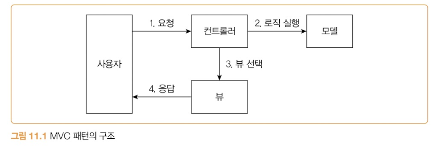
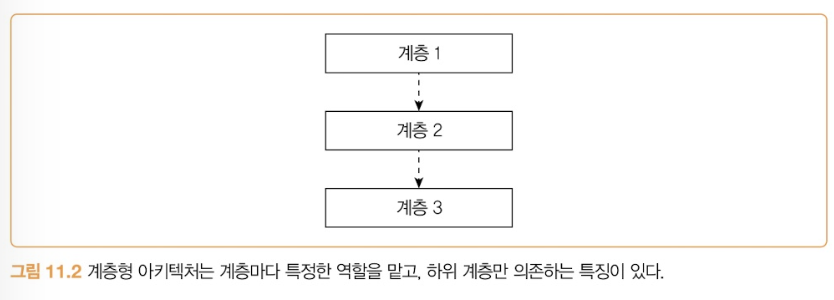
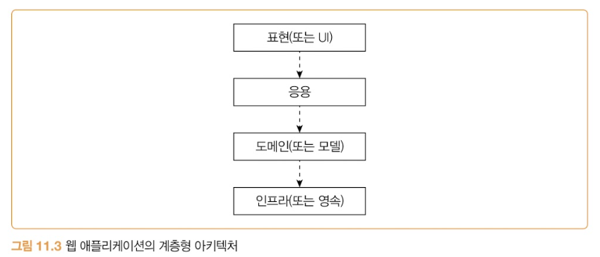
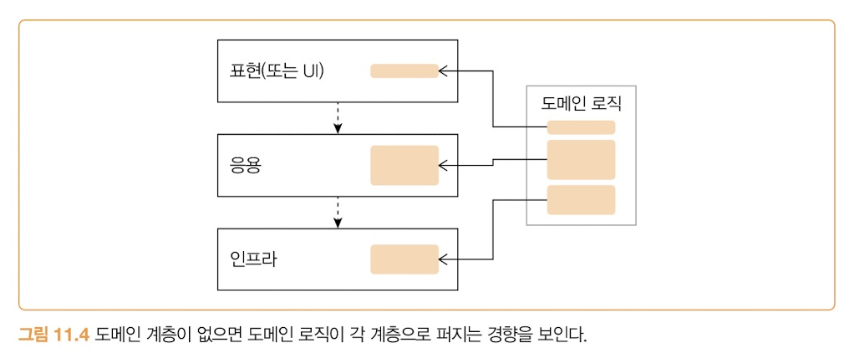
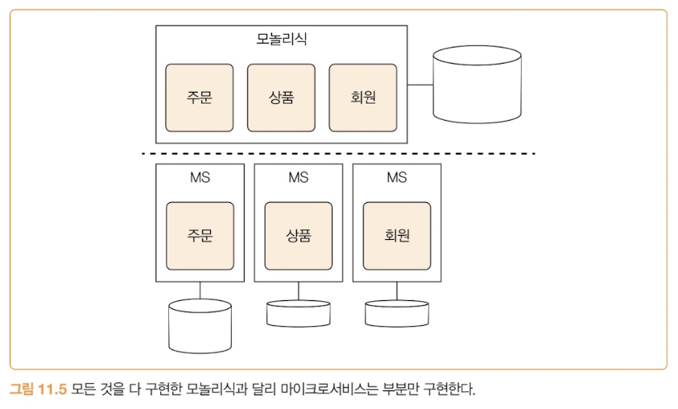
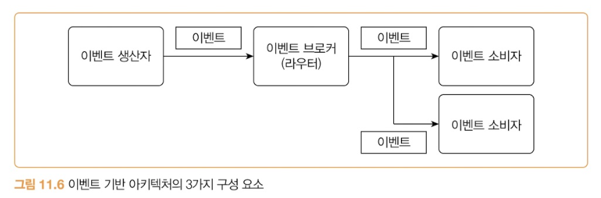
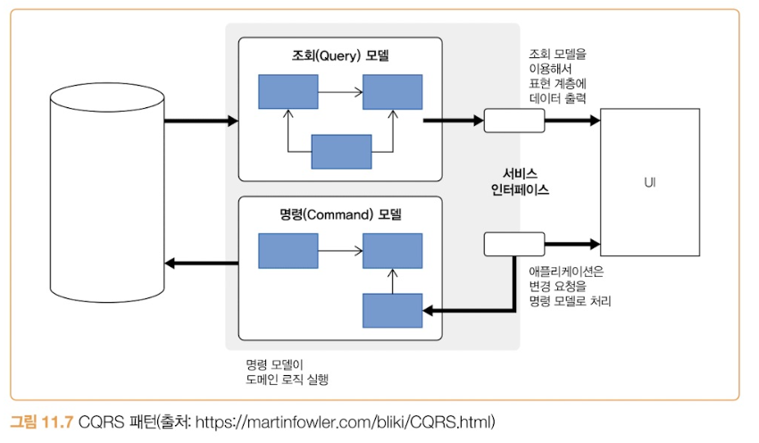

# 11장 자주 쓰는 서버구조와 설계 패턴

---
 
## 이 장을 한 줄로
 
> **아키텍처 수준에서 반복적으로 등장하는 패턴 6개를, "무엇을 어디에 두는가"라는 하나의 질문으로 꿰는 장.**
> 6개 패턴은 나열이 아니라 계단이다. 역할을 나누고(MVC) → 계층으로 세우고(계층형) → 도메인 로직이 흩어지는 걸 막고(DDD) → 서비스 단위로 쪼개고(MSA) → 쪼갠 것들을 느슨하게 잇고(이벤트 기반) → 모델 자체를 명령/조회로 가른다(CQRS).
 
## 다루는 내용
 
| 절 | 패턴 | 이 패턴이 푸는 문제 |
|---|---|---|
| 11.1 | MVC 패턴 | 요청 처리·비즈니스 로직·화면 생성이 한 덩어리로 엉킨다 |
| 11.2 | 계층형 아키텍처 | 역할별 코드의 의존 방향이 제멋대로다 |
| 11.3 | DDD와 전술 패턴 | 도메인 로직이 쿼리와 서비스로 흩어진다 |
| 11.4 | 마이크로서비스 아키텍처 | 규모가 커지면서 배포와 변경이 서로 발목을 잡는다 |
| 11.5 | 이벤트 기반 아키텍처 | 시스템끼리 직접 연결되면 함께 묶여 버린다 |
| 11.6 | CQRS 패턴 | 변경용 데이터와 조회용 데이터가 다른데 모델은 하나다 |
 
---
 
## 11.1 MVC 패턴
 
**M**odel - **V**iew - **C**ontroller. 자바의 스프링, Node.js의 Express.js가 전형적인 MVC를 사용한다.
 
| 구성 요소 | 역할 |
|---|---|
| **모델(Model)** | 회원 가입, 암호 변경 등 **비즈니스 영역의 로직**을 처리 |
| **뷰(View)** | 사용자가 보게 될 **결과를 생성**해서 응답 |
| **컨트롤러(Controller)** | 사용자의 **입력 처리와 흐름 제어**를 담당 |
 
<!-- 📷 이미지 1 : p.300 [그림 11.1] MVC 패턴의 구조 -->

 
```
사용자 ──① 요청──▶ 컨트롤러 ──② 로직 실행──▶ 모델
                      │
                      ③ 뷰 선택
                      ▼
사용자 ◀── ④ 응답 ── 뷰
```
 
- 컨트롤러는 요청을 알맞게 **해석**한 뒤 모델에 로직 실행을 **위임**한다. POST로 전송된 데이터를 요청 객체로 변환한 뒤 모델의 기능을 실행하는 식.
- 모델은 요청된 기능을 실행하고(암호 변경, 주문 배송지 변경 등) 결과를 컨트롤러에 리턴한다.
- 컨트롤러가 결과를 보고 **뷰를 선택**한다. API 컨트롤러는 JSON 응답 뷰를, 웹 페이지 컨트롤러는 HTML 응답 뷰를 고른다. 뷰가 결과를 만드는 데 필요한 데이터는 **컨트롤러를 통해** 전달받는다.
### 핵심은 두 가지
 
1. **비즈니스 로직을 처리하는 모델과, 결과를 생성하는 뷰를 분리한다.**
2. **애플리케이션의 흐름 제어와 사용자 요청 처리는 컨트롤러에 집중시킨다.**
모델은 비즈니스 로직만 처리하고 화면이나 UI 흐름 제어는 하지 않는다. 반대로 뷰는 응답을 제공하는 역할만 하고 로직이나 흐름 제어는 하지 않는다. **둘이 분리돼 있으니 서로의 변화에 영향을 덜 받는다.**
 
> 모델 내부 구현이 바뀌어도 뷰는 거의 영향받지 않고, 뷰 구현 기술을 JSP에서 타임리프로 바꿔도 모델은 거의 영향받지 않는다.
 
컨트롤러는 비즈니스 로직이나 뷰 구현을 신경 쓰지 않아도 된다. 대신 **사용자 입력 값이 유효한 형식인지 검증**하고, 쿼리 문자열을 알맞은 데이터 모델로 변환하며, **비즈니스 로직에 포함되지 않는 사용자 인증** 같은 기능을 담당한다.
 
### 의존 방향이 포인트
 
```
컨트롤러 ──▶ 모델
   └────────▶ 뷰
(뷰와 모델은 컨트롤러에 의존하지 않는다)
```
 
**컨트롤러만 모델과 뷰에 의존한다.** 덕분에 컨트롤러와 상관없이 모델과 뷰를 변경할 수 있어 유지보수가 쉬워진다.
 
---
 
## 11.2 계층형 아키텍처
 
오래된 패턴이고 아주 많은 곳에서 쓰인다. 특징은 두 가지다.
 
- 각 계층은 **특정 역할**을 수행한다.
- **하위에 위치한 계층에만 의존한다.**
<!-- 📷 이미지 2 : p.302 [그림 11.2] 계층형 아키텍처는 계층마다 특정한 역할을 맡고, 하위 계층만 의존하는 특징이 있다 -->

 
**하위 계층은 상위 계층에 대한 의존을 갖지 않는다.** 오직 상위 → 하위 방향만 허용된다. 계층 1은 계층 2에 의존하지만 계층 2는 계층 1에 의존하지 않는다.
 
의존 범위는 정하기 나름이다.
- **바로 아래 계층에만** 의존하도록 강제하거나 (계층1 → 계층2만)
- **하위에 있으면 모두** 의존을 허용하거나 (계층1 → 계층2, 계층3 모두)


### 웹 애플리케이션의 4계층
 
<!-- 📷 이미지 3 : p.303 [그림 11.3] 웹 애플리케이션의 계층형 아키텍처 -->

 
```
표현(또는 UI)
    ↓
   응용
    ↓
도메인(또는 모델)
    ↓
인프라(또는 영속)
```
 
| 계층 | 역할 | 대표 구성 요소 |
|---|---|---|
| **표현(Presentation) / UI** | 사용자와의 상호 작용 담당. 요청 처리를 응용 계층에 위임 | **MVC의 컨트롤러와 뷰** |
| **응용(Application)** | 사용자 요청을 실제로 처리. 모델·인프라 계층을 사용해 기능을 구현하고 결과를 표현 계층에 리턴 | 흔히 말하는 **서비스** |
| **도메인(Domain) / 모델** | 도메인 로직 구현. 주문의 취소 제약 조건, 상태 변경 같은 로직 | 엔티티, 애그리거트 |
| **인프라(Infrastructure) / 영속** | DB 연동, 문자 발송 같은 **구현 기술** 지원 | **DAO** |
 
**장점은 단순함이다.** 구조가 단순하고 규칙이 명확하기 때문에 코드 실행 흐름을 추적하기 쉽다.
 
### ⚠️ 흩어지는 도메인 로직
 
저자가 짚는 실무의 함정. 도메인 구현에 미숙한 개발자가 많고, **도메인 계층 없이 응용 계층과 인프라 계층만으로 구현하는 경우가 많다.** 단순히 서비스/DAO로만 구성한 계층형 아키텍처를 쓰면 실제 계층은 3개가 된다.
 
도메인 영역이 (거의) 없는 계층 구조에서는 **도메인 로직이 인프라와 응용 계층으로 분산되는 경향**이 있다.
 
<!-- 📷 이미지 4 : p.304 [그림 11.4] 도메인 계층이 없으면 도메인 로직이 각 계층으로 퍼지는 경향을 보인다 -->

 
책이 든 예시가 아프다.
 
```sql
-- MemberDao.updateMemberStatus(id)의 쿼리
update member set status = 20 where member_id = ? and status = 10
```
 
```java
int cnt = mdao.updateMemberStatus(id);
if (cnt == 0) {
    // 변경 건이 없으므로 변경 실패 처리
}
```
 
**이 자바 코드에는 어떤 도메인 로직도 없다.** DAO 메서드를 실행하고 결과 건수가 0이면 실패 처리를 할 뿐이다. *"어떤 조건일 때 상태가 변경되는가"* 를 알려면 **쿼리를 뒤져야 한다.** 상태 10 → 20이라는 규칙이 SQL의 `where` 절에 숨어버린 것.
 
이것이 도메인 모델이 빈약하거나 없을 때 나타나는 **로직 흩어짐 증상**이다. 막으려면 도메인 로직을 최대한 **한 계층으로 모아야** 하고, 그 방법 중 하나가 다음 절의 DDD 전술 패턴이다.
 
---
 
## 11.3 DDD와 전술 패턴
 
로직이 복잡한 도메인을 구현할 때는 **DDD(Domain-Driven Design)** 의 패턴을 검토해볼 만하다. DDD의 **전술 패턴**을 사용하면 도메인 영역에 도메인 로직을 집중시키는 데 도움이 된다.
 
| 구성 요소 | 설명 |
|---|---|
| **엔티티(Entity)** | 고유 식별자를 가지며 식별자로 구분된다. **내부 상태가 바뀌어도 식별자는 바뀌지 않는다.** 주문 엔티티는 서로 다른 주문번호를 식별자로 갖는다 |
| **밸류(Value)** | 고유 식별자를 갖지 않고 **개념적인 값**을 표현한다. 금액, 배송 주소 등. **불변으로 구현하는 것을 추천** |
| **애그리거트(Aggregate)** | 관련 객체를 묶어 **하나의 개념적 단위**로 표현. 주문 애그리거트 = `Order` 엔티티 + `OrderLine` 밸류 집합 + `ShippingAddress` 밸류. **모델의 일관성을 관리하는 단위** |
| **리포지토리(Repository)** | 도메인 객체를 **물리적 저장소와 연결**할 때 사용. 저장·조회 인터페이스를 제공하며 **애그리거트 단위로 존재** |
| **도메인 서비스(Domain Service)** | 특정 애그리거트에 속하지 않은 로직. 외부 연동이 필요한 도메인 로직 |
| **도메인 이벤트(Domain Event)** | 도메인 내에서 발생한 이벤트. 도메인의 **상태가 변경될 때** 발생하며, 주로 **다른 부분에 변화를 알리기 위해** 사용 |
 
DDD는 이 구성 요소로 도메인 로직을 **애그리거트 단위로 묶는다.** 복잡한 모델을 애그리거트 단위로 관리해 복잡도를 낮추고, 애그리거트에 관련 로직을 모아 **응집도를 높인다.**
 
```java
// DDD의 전술 패턴은 도메인 로직을 한 곳에 모으는 데 도움이 된다.
public class CancelOrderService {
    private OrderRepository orderRepository;
 
    @Transactional
    public void cancel(OrderNumber orderNum) {
        // 응용 서비스는 도메인 모델을 사용해서 사용자 요청을 처리한다.
        Optional<Order> orderOpt = orderRepository.findById(orderNum);
        Order order = orderOpt.orElseThrow(() -> new NoOrderException());
        // 주문 취소 로직은 Order 애그리거트에 위치한다.
        order.cancel();
    }
}
```
 
> 🔑 11.2의 나쁜 예와 비교해보자. 앞에서는 "상태 10일 때만 20으로"라는 규칙이 SQL에 있었는데, 여기서는 **`order.cancel()` 안**에 있다. 응용 서비스는 조회 → 위임만 한다. 이게 "도메인 로직을 한 계층에 모은다"의 실제 모습.
 
전술 패턴 외에도 **바운디드 컨텍스트(bounded context)** 는 도메인 간의 경계를 설정해준다. 상위 수준에서 복잡한 도메인을 관리하는 데 도움을 주며, **다음 절의 마이크로서비스 아키텍처와도 잘 어울린다.**
 
---
 
## 11.4 마이크로서비스 아키텍처
 
과거에는 하나의 애플리케이션에 모든 것을 구현하는 **모놀리식**이 일반적이었다. **마이크로서비스(MS)** 는 더 작은 단위로 서비스를 분리하고 각 서비스가 연동되는 구조를 갖는다.
 
<!-- 📷 이미지 6 : p.307 [그림 11.5] 모놀리식과 마이크로서비스 비교 -->

 
```
[모놀리식]   주문 · 상품 · 회원  →  DB 1개
 
[MS]        주문 MS → DB    상품 MS → DB    회원 MS → DB
```
 
> ⚠️ 채택하는 조직은 늘고 있지만, **유행을 좇기 위해** 도입하는 곳도 적지 않다. 단순히 새로운 기술을 써보고 싶어서, 또는 마이크로서비스가 유행이라서 도입하는 경우다. 장단점을 비교하고 **효과가 분명할 때** 도입해야 한다.
 
| | 모놀리식 | 마이크로서비스 |
|---|---|---|
| **장점** | • 배포가 단순하다<br>• 코드 관리가 더 쉽다<br>• 성능을 높이기 위해 복잡한 구조를 가질 필요가 없다<br>• 테스트와 디버깅이 쉽다 | • 독립적인 배포와 지속적인 배포가 용이<br>• 성능 확장이 용이<br>• 기술에 대한 유연성을 가질 수 있다<br>• (보통) 개발자의 만족도가 더 높다 |
| **단점** | • 규모가 커질수록 개발 속도가 느려진다<br>• 한 기능의 문제가 전체에 영향을 줄 수 있다<br>• 구현 기술 변경이 어렵다<br>• 작은 변경도 전체를 다시 배포해야 한다 | • 테스트와 디버깅이 어렵다<br>• 모놀리식 대비 인프라가 복잡하다<br>• 소통에 따른 부하가 증가한다<br>• 무분별하면 **분산 모놀리식**이 될 수 있다 |
 
### 마이크로서비스 6가지 핵심 개념
 
『마이크로서비스 아키텍처 구축』(2023, 한빛미디어)에서 제시한 판단 기준.
 
1. **독립적 배포** — 다른 MS를 배포하지 않고도 이 MS를 변경·배포·출시할 수 있어야 한다.
2. **도메인을 중심으로 모델링** — 각 MS는 도메인을 기준으로 구분해야 한다. 한 도메인의 기능 구현이 여러 MS에 걸쳐 있으면 출시 비용이 증가한다.
3. **자신의 상태를 가짐** — MS는 **DB를 공유하지 않는다.** 다른 MS의 데이터가 필요하면 DB에 직접 접근하지 않고 **API로** 접근한다.
4. **크기** — 절대적 기준은 없다. **조직이 감당할 수 있는 수준**과 **경계 정의**에 집중해야 한다.
5. **유연함** — 비용을 들여 기술·확장·견고함의 유연함을 얻는 구조다. **비용을 감당할 수 있는 수준**에서 도입을 고려한다.
6. **아키텍처와 조직을 맞춤** — *"조직 구조는 아키텍처에 영향을 준다"*(콘웨이 법칙). 비즈니스 도메인이 시스템 아키텍처를 주도하는 원동력이 되도록 설계한다.
**저자는 이 중 `1. 독립적 배포`가 가장 중요하다고 강조한다.** MS를 설계하거나 분리할 계획이라면 독립적 배포를 최우선으로 고려하고, 이를 위해 **각 MS 간 결합도를 최대한 낮춰야** 한다.
 
<details>
<summary>🗒️ 칼럼 — 모놀리식이 나쁜 건가?</summary>
  
- 마이크로서비스 만능주의에 빠진 사람은 무턱대고 모놀리식을 나쁘다고 단정한다. 모놀리식이 가진 단점만 강조하며 MS 도입을 정당화하려는 경우다.
- 하지만 **모놀리식 아키텍처 자체가 잘못된 경우는 드물다.** 대부분은 모놀리식 구조 *안의* 설계와 코드 품질이 문제다.
- 그런 문제를 가진 모놀리식을 여러 개의 MS로 분리하더라도, **구조와 코드 품질이 여전히 낮다면 결과적으로 더 복잡한 구조만 초래**할 수 있다.
- 모놀리식이어도 구조와 품질에 신경 쓰면 개발 속도를 유지하면서 짧은 배포 주기를 가질 수 있다. **모듈러 모놀리식(Modular Monolithic)** 을 사용하면 모놀리식 안에서 모듈을 잘 나누어 모듈 간 의존을 줄이고 유지보수성을 높일 수 있다.
  
</details>

---
 
## 11.5 이벤트 기반 아키텍처
 
**두 시스템 간에 통신할 때 이벤트를 사용하는 구조.** 5장에서 다룬 것과 마찬가지로, 여기서 말하는 이벤트는 **과거에 발생한 사실**을 의미한다. 그래서 이벤트는 보통 **과거형**으로 표현한다 — `주문함`, `인증에 실패함`, `주문을 취소함`.
 
### 3가지 구성 요소
 
<!-- 📷 이미지 8 : p.310 [그림 11.6] 이벤트 기반 아키텍처의 3가지 구성 요소 -->

 
```
이벤트 생산자 ──이벤트──▶ 이벤트 브로커(라우터) ──이벤트──▶ 이벤트 소비자
                                              └──이벤트──▶ 이벤트 소비자
```
 
| 구성 요소 | 하는 일 |
|---|---|
| **이벤트 생산자** | 이벤트를 생성해서 브로커에 전달 |
| **이벤트 브로커(라우터)** | 해당 이벤트에 **관심 있는 소비자**에게 전달 |
| **이벤트 소비자** | 이벤트를 받아 적절하게 반응 |
 
### 어디에 쓰나
 
- **변경된 데이터를 다른 시스템에 전달할 때** — 주문 시스템에서 `결제 완료` 이벤트가 발생하면 배송 시스템으로 전달되고, 배송 시스템은 전달받은 주문 정보를 바탕으로 배송을 시작한다.
- **알림 목적** — 사용자가 잘못된 암호를 반복 입력해 로그인에 실패하면, 인증 시스템이 `인증 실패` 이벤트를 발생시키고 이상 감지 시스템이 이를 받아 연속 실패 횟수를 추적해 비정상 접근 여부를 판단한다.
이벤트는 **메시지의 한 형태**로 볼 수 있다. 전달에는 보통 메시징 기술을 사용하는데, **카프카**가 이벤트 브로커로 많이 활용되는 대표적인 예다.
 
### 장단점
 
| | 내용 |
|---|---|
| **장점** | 생산자와 소비자가 **직접 연결되지 않고 브로커를 통해 간접 연결**된다. 덕분에 서로 간섭하지 않고 독립적으로 배포할 수 있으며, **새로운 소비자 추가도 용이**하다 |
| **단점** | 이벤트가 **중간 브로커를 거치기 때문에**, 이벤트의 **처리 상태를 추적하려면 별도의 추가 수단이 필요**하다 |
 
> 메시지 설계나 처리 시의 고려 사항은 **5장에서 다룬 내용과 동일**하다.
 
<details>
<summary>📌 이벤트 브로커와 단일 진실 공급원(Single Source of Truth)</summary>
  
- 이벤트 브로커를 **단일 진실 공급원**으로 확장해 사용하는 방식도 있다.
- 카프카는 메시지를 삭제하지 않고 저장할 수 있는데, 이 특징을 활용하면 생산자가 보낸 **모든 이벤트를 영구 보관**할 수 있다.
- 시스템의 **모든 상태 변화가 이벤트로 발생한다면**, 이벤트 기록만으로 시스템 상태의 변화를 추적할 수 있다.
- 더 나아가 카프카 같은 브로커를 **이벤트 소싱 패턴의 이벤트 저장소**로도 활용할 수 있다.

</details>

---
 
## 11.6 CQRS 패턴
 
### 문제 — 변경용 데이터와 조회용 데이터는 다르다
 
아주 단순한 시스템은 상태 변경과 상태 조회가 동일한 모습이지만, 조금만 복잡해져도 **둘이 쓰는 데이터에 차이가 생긴다.**
 
| | 사용하는 데이터 |
|---|---|
| 주문 **생성** | 주문 ID, 회원 ID, 배송지 주소, 상품 ID |
| 주문 정보 **조회** | 위 정보 + **회원 이름, 상품명** 등을 추가로 사용 |
 
서로 다른 데이터를 쓰는데도 **하나의 모델로 명령과 조회를 모두 구현하면** 모델이 복잡해지고 유지보수가 어려워진다. 주문 상태를 변경하는 코드를 보는데 조회에서만 쓰는 속성이 함께 있으면 코드 분석이 더 어려워진다. **시간이 지날수록 모델은 추가되는 기능을 지원하기 위해 점점 커진다.**
 
### 해결 — 모델을 둘로 가른다
 
**CQRS = Command Query Responsibility Segregation.**
**명령(상태를 변경하는 것)** 을 위한 모델과 **조회(상태를 조회하는 것)** 를 위한 모델을 **분리하는 패턴**이다.
 
<!-- 📷 이미지 9 : p.312 [그림 11.7] CQRS 패턴 (출처: martinfowler.com/bliki/CQRS.html) -->

 
```
        ┌── 조회(Query) 모델 ──▶ 서비스 인터페이스 ──▶ UI
  DB ───┤
        └── 명령(Command) 모델 ◀── 서비스 인터페이스 ◀── UI
             (도메인 로직 실행)
```
 
### 장점
 
- **각 기능에 맞게 모델을 구현할 수 있다.** 단일 모델을 쓰면 조회 기능 때문에 명령 기능이 영향을 받거나 그 반대의 일이 생기는데, 두 모델을 분리하면 **상호 영향 문제를 최소화**할 수 있다.
- **조회 성능을 향상시키기 쉽다.** 조회 모델이 별도로 존재하므로 **조회 모델에 캐시를 적용**하거나 **조회 전용 DB를 확장**하는 방식을 쓸 수 있다.
### 단점
 
- **작업해야 할 코드가 늘어난다.** 각 기능마다 모델을 따로 만들어야 하기 때문. 추가되는 코드 대비 얻는 이점이 더 큰지 따져봐야 한다.
  - **단순한 모델**에 적용하면 → 작업량만 늘어나고 얻는 이점은 적다
  - **복잡한 모델**에 적용하면 → 얻는 이점이 더 클 가능성이 높다
- **구현 기술이 늘어날 수 있다.** 명령 모델과 조회 모델을 서로 다른 기술로 구현하는 경우가 많다. 특히 높은 트래픽을 처리하려고 조회 모델을 **별도 조회 전용 DB**에 구축하는 경우, **서로 다른 DB 간 데이터 동기화를 위해 추가적인 메시징 수단을 도입해야 한다.**
> 🔑 여기서 11.5와 이어진다. CQRS의 읽기/쓰기 저장소 동기화가 바로 **이벤트 기반 아키텍처가 필요해지는 지점**이다. 패턴 하나를 도입하면 다음 패턴이 따라온다는 게 이 장의 숨은 메시지.
 
---
 
## 정리 — 6개 패턴을 관통하는 축
 
```
"무엇을 어디에 둘 것인가"
 
MVC          역할을 3개로 나눈다        (요청·로직·화면)
  ↓
계층형        나눈 역할을 세로로 쌓고    (의존은 아래로만)
  ↓          의존 방향을 고정한다
DDD          비어 있던 도메인 계층을     (애그리거트 단위로 응집)
  ↓          실제로 채운다
MSA          계층 묶음을 서비스 단위로   (독립적 배포가 최우선)
  ↓          잘라낸다
이벤트 기반    잘라낸 것들을 브로커로     (직접 연결 대신 간접 연결)
  ↓          느슨하게 잇는다
CQRS         모델 자체를 명령/조회로     (동기화는 다시 이벤트로)
             한 번 더 가른다
```
 
### 판단 기준 체크리스트
 
- [ ] 서비스 클래스가 DAO 호출과 `if (cnt == 0)`만 하고 있지 않은가? → **도메인 로직이 쿼리로 새는 중**
- [ ] "이 조건일 때 상태가 바뀐다"를 알기 위해 **SQL을 열어야** 하는가?
- [ ] 계층 간 의존이 **아래 방향으로만** 흐르는가? 인프라가 응용을 참조하고 있진 않은가?
- [ ] MSA 도입을 검토 중이라면 → **독립적 배포**가 실제로 가능한 경계인가? 아니면 유행 때문인가?
- [ ] MS끼리 **DB를 공유**하고 있진 않은가? (공유하면 분산 모놀리식)
- [ ] CQRS 도입 전 → 모델이 **분리할 만큼 복잡한가?** 단순하면 작업량만 늘어난다
- [ ] 조회 전용 DB를 둘 거라면 → **동기화 수단**까지 설계에 포함했는가?
