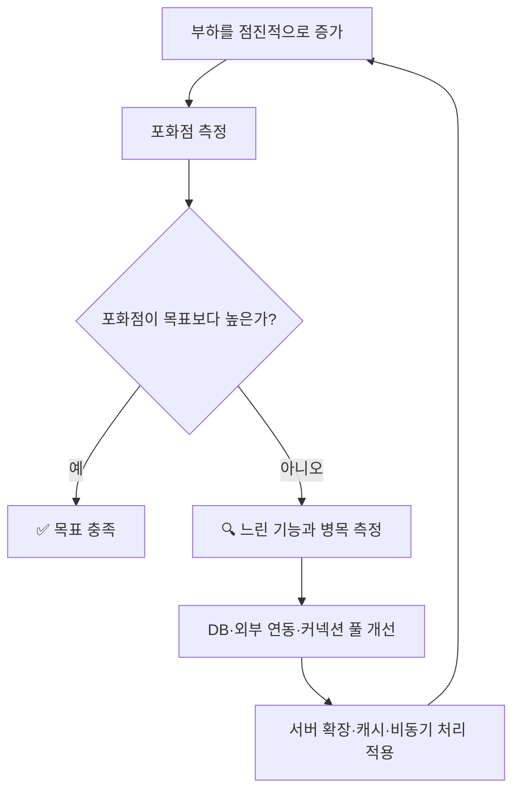

# 성능 테스트: 포화점과 주요 측정 지표

## 목차

1. 포화점으로 목표 달성 여부 판단하기
2. 병목 지점 찾기
3. 주요 측정 지표
4. 응답 시간 해석하기
5. 성능 개선 반복 과정
6. 결과 확인 체크리스트

---

## 1. 🎯 포화점으로 목표 달성 여부 판단하기

성능 테스트는 서버가 목표 트래픽을 안정적으로 처리할 수 있는지 확인하는 과정이다.

부하를 점진적으로 높이면 초기에는 처리량도 함께 증가한다. 어느 시점부터 처리량이 더 이상 증가하지 않고 응답 시간과 에러율이 급격히 나빠진다. 성능이 무너지기 직전의 최대 처리량이 **포화점**이다.

```text
부하 증가
   ↓
처리량 증가
   ↓
처리량 증가 폭 감소
   ↓
응답 시간·에러율 급증
   ↓
포화점 도달
```

판단 기준은 단순하다.

| 비교 결과 | 판단 | 다음 행동 |
|---|---|---|
| 포화점 > 목표 성능 | 목표 충족 | 테스트 종료 가능 |
| 포화점 = 목표 성능 | 여유 용량 없음 | 병목 개선 필요 |
| 포화점 < 목표 성능 | 목표 미달 | 병목 개선 후 재시험 |

포화점이 목표와 같아도 운영 여유가 없다. 순간적인 트래픽 증가나 외부 시스템 지연을 감당할 수 있도록 목표보다 높은 포화점을 확보해야 한다.

> 🔑 **핵심:** 최대 TPS만 확인하지 않는다. 포화점 부근의 응답 시간과 에러율이 허용 범위인지 함께 확인한다.

---

## 2. 🔍 병목 지점 찾기

웹 서버의 병목은 주로 **호출 비중이 높고 응답 시간이 긴 기능**에서 발생한다.

대표적인 원인은 다음과 같다.

| 병목 후보 | 확인 대상 | 개선 방향 |
|---|---|---|
| DB 연동 | 쿼리 실행 시간, 실행 계획, 호출 횟수 | 쿼리 개선, 인덱스, 캐시 |
| 외부 연동 | 외부 API 응답 시간, 타임아웃 | 비동기 처리, 호출 축소, 캐시 |
| 커넥션 풀 | 대기 시간, 활성·유휴 커넥션 수 | 풀 크기 조정, 쿼리 시간 단축 |
| 서버 자원 | CPU·메모리 사용률 | 서버 확장, 작업량 감소 |

커넥션 풀 크기는 무조건 크게 설정하면 안 된다. 애플리케이션의 대기는 줄어들 수 있지만 DB가 감당할 연결 수를 넘으면 병목이 DB로 이동한다.

> ⚠️ **주의:** 추측으로 개선하지 않는다. 느린 API, 쿼리 시간, 외부 호출 시간, 커넥션 대기 시간과 자원 사용률을 먼저 측정한다.

---

## 3. 📊 주요 측정 지표

성능 테스트에서는 처리량만 보지 않고 응답 시간, 에러율, 자원 사용률을 함께 측정한다.

| 지표 | 의미 | 확인 목적 |
|---|---|---|
| 처리량 | 초당 처리한 요청 수(TPS/RPS) | 서버의 처리 한계 확인 |
| 응답 시간 | 요청부터 응답까지 걸린 시간 | 사용자 체감 성능과 지연 확인 |
| 에러율 | 전체 요청 중 실패한 요청의 비율 | 부하를 감당하지 못하는 지점 확인 |
| CPU 사용률 | CPU가 사용된 비율 | 연산 자원 병목 확인 |

다음 현상이 함께 나타나면 포화점에 도달했을 가능성이 높다.

```text
처리량 증가 정체
       +
응답 시간 급증
       +
에러율 증가
       =
포화 가능성 증가
```

---

## 4. ⏱️ 응답 시간 해석하기

응답 시간은 하나의 값으로 판단하면 안 된다. 최소한 다음 값을 함께 확인한다.

| 지표 | 의미 | 제약 |
|---|---|---|
| 평균(Mean) | 전체 응답 시간의 합 ÷ 요청 수 | 일부 느린 요청의 영향을 크게 받음 |
| 최소(Min) | 가장 빠른 응답 시간 | 최상의 상황만 보여 줌 |
| 최대(Max) | 가장 느린 응답 시간 | 단일 이상치의 영향을 크게 받음 |
| 중앙값(P50) | 절반의 요청이 이 시간 이내에 완료 | 긴 꼬리 지연을 드러내지 못함 |
| P95 | 95%의 요청이 이 시간 이내에 완료 | 느린 상위 5%는 별도 확인 필요 |
| P99 | 99%의 요청이 이 시간 이내에 완료 | 사용자 일부가 겪는 긴 지연 확인 |

### 평균과 최대의 차이가 큰 경우

평균만 보면 대부분의 요청이 빠른 것처럼 보일 수 있다. 이때 P95와 P99를 확인해야 한다.

```text
평균 120ms
P95  180ms
P99  240ms
최대 4,800ms
```

P95와 P99가 평균에 가깝고 최대만 매우 크다면 최대값이 일시적인 이상치일 수 있다. 하지만 같은 현상이 반복되거나 실패와 연결된다면 이상치로 치부하지 않고 원인을 확인해야 한다.

### 평균이 중앙값보다 큰 경우

```text
P50  100ms
평균 180ms
P99  1,200ms
```

일부 느린 요청이 평균을 끌어올리고 있다는 뜻이다. 일반적인 통계 용어로는 **오른쪽 꼬리가 긴 분포 또는 양의 왜도**에 해당한다.

> 📝 **원문 보정:** 평균이 중앙값보다 큰 분포를 원문은 `좌편향`으로 표현했지만, 일반적인 통계 정의에서는 오른쪽 편향(right-skewed)으로 설명한다.

### 백분위 값 읽는 방법

P99가 `500ms`라는 말은 전체 요청의 99%가 `500ms` 이내에 끝났다는 뜻이다. 나머지 1%는 `500ms`보다 오래 걸렸다.

```text
빠른 요청 99% ──────────────────────┐ 500ms 이내
느린 요청  1%                       └ 500ms 초과
```

> 🔑 **핵심:** 평균은 전체 경향, P50은 일반적인 요청, P95·P99는 느린 사용자 경험, 최대값은 최악의 단일 사례를 보여 준다.

---

## 5. 🔁 성능 개선 반복 과정

성능 테스트는 한 번 실행하고 끝나는 작업이 아니다. 목표를 충족할 때까지 측정과 개선을 반복한다.



응답 시간을 줄이면 같은 시간에 더 많은 요청을 처리할 수 있다. 단, 실제 병목의 작업량이나 대기 시간이 감소했을 때만 포화점이 높아진다.

---

## 6. ✅ 결과 확인 체크리스트

- [ ] 목표 TPS/RPS와 허용 응답 시간을 먼저 정의했는가?
- [ ] 낮은 부하부터 시작해 포화점까지 점진적으로 높였는가?
- [ ] 처리량과 함께 에러율을 확인했는가?
- [ ] 평균뿐 아니라 P50, P95, P99, 최대값을 확인했는가?
- [ ] 호출 비중이 높고 느린 API를 찾았는가?
- [ ] DB 쿼리와 외부 API 시간을 분리해서 측정했는가?
- [ ] 커넥션 풀 대기 시간과 서버 자원 사용률을 확인했는가?
- [ ] 개선 전후를 같은 조건에서 다시 측정했는가?

---

## 정리

성능 테스트의 목적은 가장 높은 TPS 숫자를 만드는 것이 아니다. **목표 부하에서 허용 가능한 응답 시간과 에러율을 유지하는지 검증하는 것**이다.

포화점이 목표보다 낮거나 같다면 호출 비중이 높고 느린 기능부터 분석한다. DB 쿼리, 외부 연동, 커넥션 풀과 서버 자원을 측정한 뒤 병목에 맞는 개선을 적용하고 동일한 조건으로 다시 테스트한다.

> 🎯 **최종 기준:** `목표 부하 충족 + 응답 시간 기준 충족 + 에러율 기준 충족 + 운영 여유 확보`
